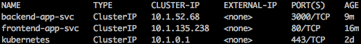
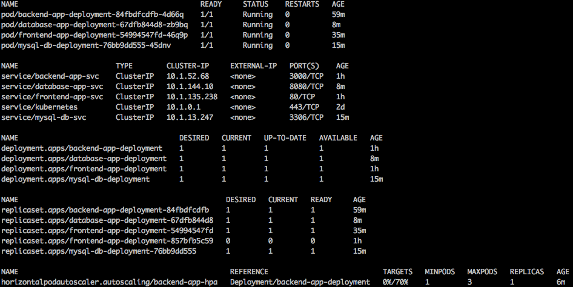

# How-to create a microservice with Kubernetes on Alibaba Cloud

## Summary

1. [Introduction](#introduction)
2. [Prerequisite](#prerequisite)
3. [Step 1 - Create a Kubernetes cluster](#step-1---create-a-kubernetes-cluster)
4. [Step 2-1 - Prepare to deploy applications](#step-2-1---prepare-to-deploy-applications)
5. [Step 2-2 - Deploy a front-end application](#step-2-2---deploy-a-front-end-application)
6. [Step 2-3 - Deploy a back-end application](#step-2-3---deploy-a-back-end-application)
7. [Step 2-4 - Update the front-end application](#step-2-4---update-the-front-end-application)
8. [Step 2-5 - Create a database](#step-2-5---create-a-database)
9. [Step 2-6 - Deploy a database API application](#step-2-6---deploy-a-database-api-application)
10. [Step 3 - Configure auto scaling](#step-3---configure-auto-scaling)
11. [Step 4-1 - Integrate Istio to the Kubernetes cluster](#step-4-1---integrate-istio-to-the-kubernetes-cluster)
12. [Step 4-2 - Operation with Istio](#step-4-2---operation-with-istio)
13. [Step 4-3 - Configure TLS with Istio](#step-4-3---configure-tls-with-istio)
14. [Cleanup](#cleanup)
15. [Support](#support)


## Introduction

The goal of this tutorial is to explain how to create a microservice with Kubernetes on Alibaba Cloud. [Microservices](https://microservices.io/) is a widely used architectural style that structures an application as a collection of services. It has benefit such as selection of appropriete technology, efficient deployment, or simplification of scaling, for each service.

[Kubernetes](https://kubernetes.io/) is a portable, extensible, open-source platform for managing containerized workloads and services. It's popular and becomes the de-facto standard platform to realize microservice with container technology in cloud environment. This tutorial will introduce a architecture of microservices with [Alibaba Cloud Container Service for Kubernetes](https://www.alibabacloud.com/help/doc-detail/86737.htm), which is a container application management service using Kubernetes to support microservice architecture in Alibaba Cloud.

Through this tutorial, we will create a small microservice on a Kubernetes cluster step by step. First, create a Kubernetes cluster on Alibaba Cloud with [Terraform](https://www.terraform.io/). Then, create application docker images on [Container Registry](https://www.alibabacloud.com/help/doc-detail/60945.htm), which is a container image hosting service in Alibaba Cloud, and deploy applications to the Kubernetes cluster. Farthermore, we will integrate [Istio](https://istio.io/) to the cluster and enrich the microservice. To focus on microeservice infrastructure construction, we will use the prepared sample applications in this repository, which contains a front-end web application, a back-end web API application, and a database API application. After completing this tutorial, you will know how to use Alibaba Cloud Container Service and common used container technologies.

The *samples* directory in this repository shows sample configuration files in this tutorial as reference.

The following figure shows the architecture of the microservice created in this tutorial.


## Prerequisite

### Alibaba Cloud

Before starting this tutorial, you need to prepare the following things.

1. An Alibaba Cloud account

    You need an Alibaba Cloud account. If you don't have any account, please follow
    [this document to create one](https://www.alibabacloud.com/help/doc-detail/50482.htm).

2. An access key of an Alibaba Cloud account

    You need an accessKeyId and an accessKeySecret to create your Alibaba Cloud products by Terraform. Please follow
    [this document to obtain an access key id and secret](https://www.alibabacloud.com/help/faq-detail/63482.htm).

3. A domain registered in Alibaba Cloud

    You need a domain registered in Alibaba Cloud to configure the domain name for applications. If you don't have any domain, please follow [this document to obtain new domain](https://www.alibabacloud.com/help/doc-detail/54068.htm). If you already have some domain, please follow [this document to register your domain](https://www.alibabacloud.com/help/doc-detail/58153.htm).

    You can check the domain list you registered in Alibaba Cloud from the [Domain web console](https://dc.console.aliyun.com/next/index#/domain/list/all-domain).

### Local environment

* [Terraform](https://www.terraform.io/)

We will use Terraform in this tutorial to construct the cloud envirionment, mainly for the Kubernetes cluster. It is a powerful tool of Infrastructure as code made by HashCorp. It can automate constructing cloud infrastructure and enables us to create cloud resources effectively. Also, it enables us to manage the cloud infrastructure with files. Terraform configuration files contain the information of cloud resources and the architecture, and Terraform saves the state of cloud resources in files after it applys changes. You can install it from the [official site](https://www.terraform.io/downloads.html).

You can check that you have Terraform with the following command:

```sh
terraform -v
```

* [Docker](https://www.docker.com/)

We will use Docker to create and to store container images to the container registory. It is a widely used container technology to create a container which is a standard unit of software package containing application source code and dependencies. You can install it from the [official site](https://docs.docker.com/install/#supported-platforms).

You can check that you have Docker with the following command:

```sh
docker -v
```

* [kubectl](https://kubernetes.io/docs/tasks/tools/install-kubectl/)

It is a Kubernetes command-line tool. We will use kubectl command to operate Kubernetes cluster resources. You can install it from the [official site](https://kubernetes.io/docs/tasks/tools/install-kubectl/).

You can check that you have kubectl with the following command:

```sh
kubectl version
```

This tutorial was checked with the following enviroinment:

* macOS High Sierra: 10.13.4
* Terraform: 0.11.14 (with plugin for provider "alicloud" (1.52.0)) (**UPDATED** The guide for the Terraform script also checked with v0.12.x)
* Docker Desktop community: 2.0.0.3
* Kubernetes: v1.10.11(Client), v1.11.5(Server)


## Step 1 - Create a Kubernetes cluster

First of all, we create a Kubernetes cluster on Alibaba Cloud by Terraform.

In this step, we will create a [Virtual Private Cloud (VPC)](https://www.alibabacloud.com/help/doc-detail/34217.htm), which is a vertual private network service in Alibaba Cloud, create a [VSwitch](https://www.alibabacloud.com/help/doc-detail/100380.htm) in the VPC, which is a network device in VPC used to create a subnet and connects cloud product instances in VPC, and create a Kubernetes cluster in the VSwitch.

1. Prepare a working directory

    Before working on this tutorial, create your working directory for this tutorial. For example, "~/Desktop/alibaba/howto/microservices/".

    ```sh
    cd /<path>/<to>/<your>/<working>/<directory>/
    ```

    Then, clone this repository and change the working directory to the repository root directory.

    ```sh
    cd howto-microservices-with-k8s/
    ```

2. Create Terraform configuration files

    First, prepare a variable definition file named *terraform.tfvars*, which will be loaded from Terraform main script. Run the following command to create a directory and create the file,

    ```sh
    mkdir -p infrastructure/terraform/ && cd $_
    touch terraform.tfvars
    ```

    and copy the following content into the file.

    `terraform.tfvars`
    ```sh
    # The access key id of the Alibaba Cloud account
    access_key = "xxxxxxxxxxxxxxxx"
    # The access key secret of the Alibaba Cloud account
    secret_key = "xxxxxxxxxxxxxxxxxxxxxxxxxxxxxx"
    # Region in Alibaba Cloud
    region = "ap-northeast-1"
    # The SSH key name of the Alibaba Cloud ECS
    ssh_key_name = "ssh-microservices-k8s-tf"
    # The file path of the SSH key which will be saved on local
    ssh_key_local_path = "./ssh-microservices-k8s-tf.pem"
    # Prefix for the name of the cloud resource
    prefix = "tf-howto-"
    # Suffix for the name of the cloud resource
    suffix = "-microservices-k8s"
    ```

    Please change *access_key*, and *secret_key* to yours accordingly. You can check them in [this web console page](https://usercenter.console.aliyun.com/#/manage/ak). Follow [this step](#prerequisite) if you don't have anyone. For other parameters, you don't need to change the values.

    Second, create a Terraform script file,

    ```sh
    touch main.tf
    ```

    and copy the following content into the file.

    `main.tf`
    ```sh
    # Variable
    variable "access_key" {}
    variable "secret_key" {}
    variable "region" {}
    variable "ssh_key_name" {}
    variable "ssh_key_local_path" {}
    variable "prefix" {}
    variable "suffix" {}


    # Provision
    provider "alicloud" {
        access_key = "${var.access_key}"
        secret_key = "${var.secret_key}"
        region = "${var.region}"
    }


    # VPC
    resource "alicloud_vpc" "vpc" {
        cidr_block = "192.168.0.0/16"
        name = "${var.prefix}vpc${var.suffix}"
    }

    # VSwitch
    data "alicloud_zones" "zones" {
        available_resource_creation = "VSwitch"
    }
    resource "alicloud_vswitch" "vswitch" {
        vpc_id = "${alicloud_vpc.vpc.id}"
        availability_zone = "${data.alicloud_zones.zones.zones.0.id}"
        cidr_block = "192.168.0.0/24"
        name = "${var.prefix}vswitch${var.suffix}"
    }

    # SSH key pair
    resource "alicloud_key_pair" "keypair" {
        key_name = "${var.ssh_key_name}"
        key_file = "${var.ssh_key_local_path}"
    }

    # k8s
    data "alicloud_instance_types" "type2c8g" {
        availability_zone = "${data.alicloud_zones.zones.zones.0.id}"
        cpu_core_count = 2
        memory_size = 8
        kubernetes_node_role = "Worker"
    }
    resource "alicloud_cs_kubernetes" "k8s" {
        name_prefix = "${var.prefix}k8s${var.suffix}"
        vswitch_ids = ["${alicloud_vswitch.vswitch.id}"]
        new_nat_gateway = true

        cluster_network_type = "flannel"
        pod_cidr = "10.0.0.0/16"
        service_cidr = "10.1.0.0/16"

        master_instance_types = ["${data.alicloud_instance_types.type2c8g.instance_types.0.id}"]
        worker_instance_types = ["${data.alicloud_instance_types.type2c8g.instance_types.0.id}"]
        worker_numbers = [2]

        enable_ssh = true
        key_name = "${alicloud_key_pair.keypair.key_name}"
    }


    # Output
    output "vpc__vpc_id" {
        value = "${alicloud_vpc.vpc.id}"
    }
    output "key_pair__key_name" {
        value = "${alicloud_key_pair.keypair.key_name}"
    }
    output "k8s__master_public_ip" {
        value = "${lookup(alicloud_cs_kubernetes.k8s.connections, "master_public_ip", "unknown")}"
    }
    output "k8s__api_server_internet" {
        value = "${lookup(alicloud_cs_kubernetes.k8s.connections, "api_server_internet", "unknown")}"
    }
    output "k8s__api_server_intranet" {
        value = "${lookup(alicloud_cs_kubernetes.k8s.connections, "api_server_intranet", "unknown")}"
    }
    ```

    It describes we use Alibaba Cloud as cloud provider, and require a VPC, a VSwitch, and a Kubernetes cluster. We configured the cluster with NAT gateway for internet access, cluster network type as [flunnel](https://www.alibabacloud.com/help/doc-detail/86949.html), and two worker node whose instance type have 2 core CPU and 8GB memory specification. In Alibaba Cloud Kubernetes, the number of master node is three.

    Please note that we also configured a SSH login for the cluster with a new SSH key, in order to get to the cluster config using scp command later. The key will be downloaded in the current working directory on local when applying the script finished.

2. Apply Terraform script

    We have prepared the Terraform script with a Kubernetes cluster configuration. So, let's apply it and create the cluster.

    Run the following command to initialize Terraform:

    ```sh
    terraform init
    ```

    Run the following command to verify the script:

    ```sh
    terraform plan
    ```

    You can check what will happen before you apply the script. The result should be like this:

    ```
    ...

    ------------------------------------------------------------------------

    An execution plan has been generated and is shown below.
    Resource actions are indicated with the following symbols:
      + create

    Terraform will perform the following actions:

      + alicloud_cs_kubernetes.k8s
          id:                          <computed>
          availability_zone:           <computed>
          cluster_network_type:        "flannel"
          connections.%:               <computed>
          enable_ssh:                  "true"
          install_cloud_monitor:       "false"
          key_name:                    "ssh-microservices-k8s-tf"
          master_disk_category:        "cloud_efficiency"
          master_disk_size:            "40"
          master_instance_charge_type: "PostPaid"
          master_instance_types.#:     "1"
          master_instance_types.0:     "ecs.sn2.medium"
          master_nodes.#:              <computed>
          name:                        <computed>
          name_prefix:                 "tf-howto-k8s-microservices-k8s"
          nat_gateway_id:              <computed>
          new_nat_gateway:             "true"
          node_cidr_mask:              "24"
          pod_cidr:                    "10.0.0.0/16"
          security_group_id:           <computed>
          service_cidr:                "10.1.0.0/16"
          slb_id:                      <computed>
          slb_internet:                <computed>
          slb_internet_enabled:        "true"
          slb_intranet:                <computed>
          vpc_id:                      <computed>
          vswitch_ids.#:               <computed>
          worker_disk_category:        "cloud_efficiency"
          worker_disk_size:            "40"
          worker_instance_charge_type: "PostPaid"
          worker_instance_types.#:     "1"
          worker_instance_types.0:     "ecs.sn2.medium"
          worker_nodes.#:              <computed>
          worker_numbers.#:            "1"
          worker_numbers.0:            "2"

      + alicloud_key_pair.keypair
          id:                          <computed>
          finger_print:                <computed>
          key_file:                    "./ssh-microservices-k8s-tf.pem"
          key_name:                    "ssh-microservices-k8s-tf"

      + alicloud_vpc.vpc
          id:                          <computed>
          cidr_block:                  "192.168.0.0/16"
          name:                        "tf-howto-vpc-microservices-k8s"
          resource_group_id:           <computed>
          route_table_id:              <computed>
          router_id:                   <computed>
          router_table_id:             <computed>

      + alicloud_vswitch.vswitch
          id:                          <computed>
          availability_zone:           "ap-northeast-1a"
          cidr_block:                  "192.168.0.0/24"
          name:                        "tf-howto-vswitch-microservices-k8s"
          vpc_id:                      "${alicloud_vpc.vpc.id}"


    Plan: 4 to add, 0 to change, 0 to destroy.

    ------------------------------------------------------------------------

    Note: You didn't specify an "-out" parameter to save this plan, so Terraform
    can't guarantee that exactly these actions will be performed if
    "terraform apply" is subsequently run.
    ```

    Then, run the following command,

    ```sh
    terraform apply
    ```

    and type **yes** to construct the infrastructure on cloud. The result should be like this:

    ```sh
    ...

    alicloud_cs_kubernetes.k8s: Still creating... (16m31s elapsed)
    alicloud_cs_kubernetes.k8s: Creation complete after 16m40s (ID: c105c7bb7eb334067b69b0f8fc598ffc4)

    Apply complete! Resources: 4 added, 0 changed, 0 destroyed.

    Outputs:

    k8s__api_server_internet = https://xxx.xxx.xxx.xxx:6443
    k8s__api_server_intranet = https://192.168.xxx.xxx:6443
    k8s__master_public_ip = xxx.xxx.xxx.xxx
    key_pair__key_name = ssh-microservices-k8s-tf
    vpc__vpc_id = vpc-xxxxxxxxxxxxxxxxxxxxx
    ```

    After it finished, you can see the VPC you created in [Alibaba Cloud VPC web console](https://vpc.console.aliyun.com/vpc/), and the Kubernetes cluster you created in [Alibaba Cloud Container service web console](https://cs.console.aliyun.com/#/k8s/cluster/list). Please note that the region of the web console is correct one.

3. Organize cluster access

    To manage the Kubernetes cluster from a terminal easily, we will configure the access to the Kubernetes cluster in this step.

    Kubernetes provides three ways to configure the access to the Kubernetes cluster in this order of priority; using kubectl command with *--kubeconfig* option, setting *KUBECONFIG* environment variable, or putting the config file in *$HOME/.kube/config*. To keep your home directory clean and avoid your current config file to be overwritten, this tutorial uses the [*KUBECONFIG* environment variable](https://kubernetes.io/docs/concepts/configuration/organize-cluster-access-kubeconfig/#the-kubeconfig-environment-variable) one.

    Download the Kubernetes config file and set the *KUBECONFIG* envirionment variable.

    ```sh
    scp -o StrictHostKeyChecking=no -o UserKnownHostsFile=/dev/null -i ssh-microservices-k8s-tf.pem root@$(terraform output | grep "master_public_ip" | cut -d"=" -f2 | tr -d " "):/etc/kubernetes/kube.conf ./kubeconfig
    ls -ltr

    mkdir -p ../kubernetes
    cd ../kubernetes
    cp ../terraform/kubeconfig .
    export KUBECONFIG="$(pwd)/kubeconfig"
    echo $KUBECONFIG
    ls -ltr
    ```

    and verify it works as follows:

    ```sh
    kubectl get all
    ```

    You should see a Kubernetes service with Cluster IP.

Now, you completed to create a Kubernetes cluster in your VPC in Alibaba Cloud! We will deploy sample applications in the next step.


## Step 2-1 - Prepare to deploy applications

In this step, we will prepare a container registory on Alibaba Cloud as preparation. Unfortunately, Terrform doesn't support to manage the container registory on Alibaba Cloud, we will do the preparation on the web console. If you already have your container registory on Alibaba Cloud, you can skip this step.

In the later step, we will use the container registory to deploy a front-end web application, a back-end web API application, and a database API application on the cluster. Behind the database API application, we create and use a MySQL database on the cluster.

### Container Registory configuration

Please note that this tutorial will show an example with *ap-northeast-1* region.

1. Create a namespace

    1. Go to the [Namespaces page](https://cr.console.aliyun.com/ap-northeast-1/instances/namespaces) in the Container Registory web console.

    2. Click the *Create Namespace* button at top-right corner.

    3. Input your namespace name, which will be refered as *CONTAINER_REGISTRY_NAMESPACE* later.

      

    4. Click the *Confirm* button.

2. Obtain credentials

    1. Go to the [Access Credential page](https://cr.console.aliyun.com/ap-northeast-1/instances/credentials).

    2. Click *Set Password* button at right side.

    3. Set your password, which will be refered as *CONTAINER_REGISTRY_PASSWORD* later.

      

    4. Check the username at bottom, which will be refered as *CONTAINER_REGISTRY_USERNAME* later.

    5. Check the resitory url at bottom, which will be refered as *CONTAINER_REGISTRY_REGISTRY_URL* later.

      


## Step 2-2 - Deploy a front-end application

We finished the preparation. Let's deploy a front-end web application first on the cluster. It has a simple webpage to search user data.

To build the Vue.js front-end application in the later step, you need [npm](https://github.com/npm/cli) command on your local machine. Please install it if you don't have.

You can check that you have npm with the following command:

```sh
npm -v
```

This tutorial was checked with the following enviroinment:

* npm: 6.9.0


1. Build the application

    Change the working directory as follows:

    ```sh
    cd ../../  # It should be /<path>/<to>/<your>/<working>/<directory>/<repsitory-root>

    cd app/front/
    ```

    Then, build the application with the following command:

    ```sh
    npm install && npm run build
    ```

2. Push a docker image to the container repository

    The front-end web application is created with [Vue.js](https://vuejs.org/index.html), which is a front-end javascript framework. And, we will serve the application with [Nginx](https://nginx.org/en/), which is a web server. We will create a container image which contains the application and Nginx configuration file in this step.

    First, create a Dockerfile,

    ```sh
    touch Dockerfile
    ```

    and copy the following content into the file.

    `Dockerfile`
    ```Dockerfile
    FROM nginx

    MAINTAINER howto-microservices

    # nginx config
    COPY ./nginx.conf /etc/nginx/conf.d/default.conf

    # app source
    COPY ./dist/ /var/www/html/
    ```

    Then, create a script to build and push the container image as follows:

    ```sh
    touch docker_image_build_and_push.sh
    ```

    `docker_image_build_and_push.sh`
    ```sh
    #!/usr/bin/env bash

    # Variables
    CONTAINER_REGISTRY_USERNAME=xxxx@alicloudintl
    CONTAINER_REGISTRY_PASSWORD=xxxxxxxx
    CONTAINER_REGISTRY_NAMESPACE=xxxxx
    CONTAINER_REGISTRY_REGISTRY_URL=registry.ap-northeast-1.aliyuncs.com
    CONTAINER_REGISTRY_IMAGE_NAME=howto-microservices-frontend-app
    CONTAINER_REGISTRY_IMAGE_VERSION=1.0.0
    CONTAINER_REGISTRY_REPOSITORY_URL=$CONTAINER_REGISTRY_REGISTRY_URL/$CONTAINER_REGISTRY_NAMESPACE/$CONTAINER_REGISTRY_IMAGE_NAME

    # Build a container image
    docker build -t $CONTAINER_REGISTRY_IMAGE_NAME:$CONTAINER_REGISTRY_IMAGE_VERSION .

    # Push a container image
    echo $CONTAINER_REGISTRY_PASSWORD | docker login -u=$CONTAINER_REGISTRY_USERNAME --password-stdin $CONTAINER_REGISTRY_REGISTRY_URL
    docker tag $CONTAINER_REGISTRY_IMAGE_NAME:$CONTAINER_REGISTRY_IMAGE_VERSION $CONTAINER_REGISTRY_REPOSITORY_URL:$CONTAINER_REGISTRY_IMAGE_VERSION
    docker push $CONTAINER_REGISTRY_REPOSITORY_URL:$CONTAINER_REGISTRY_IMAGE_VERSION

    # Output value used in the Kubernetes configuration
    echo
    echo 'container image:'
    echo $CONTAINER_REGISTRY_REPOSITORY_URL:$CONTAINER_REGISTRY_IMAGE_VERSION
    ```

    This file contains the definition of credentials as variables. Please change *CONTAINER_REGISTRY_USERNAME*, *CONTAINER_REGISTRY_PASSWORD*, *CONTAINER_REGISTRY_NAMESPACE* and *CONTAINER_REGISTRY_REGISTRY_URL* to yours accordingly. If you are not sure about these parameter values, check [this step](#container-registory-configuration). For other parameters, you don't need to change them.

    After created the script, run it as follows:

    ```sh
    sh docker_image_build_and_push.sh
    ```

    Please note the container image information at the end of the output, which will be used in the Kubernetes configuration.

    Now, you have pushed the container image to the container registory. You can verify it in the [Container Registory web console](https://cr.console.aliyun.com/ap-northeast-1/instances/repositories). Please note that the region of the web console is correct one.

3. Deploy the front-end application container to the cluster

    You have created a front-end web application container. Let's deploy it on the cluster.

    1. Change the working directory

        As preparation, change the working directory.

        ```sh
        cd ../../  # It should be /<path>/<to>/<your>/<working>/<directory>/<repsitory-root>

        mkdir -p infrastructure/kubernetes/front && cd $_
        ```

    2. Create a Kubernetes configuration file

        To deploy the container to the Kubernetes cluster, we need a Kubernetes Deployment configuration.

        Create a Deployment configuration file for the front-end web application,

        ```sh
        touch frontend-app-deployment.yml
        ```

        and copy the following content into the file.

        `frontend-app-deployment.yml`
        ```yml
        apiVersion: apps/v1
        kind: Deployment
        metadata:
          name: frontend-app-deployment
        spec:
          selector:
            matchLabels:
              app: frontend-app
          replicas: 1
          template:
            metadata:
              labels:
                app: frontend-app
            spec:
              containers:
              - name: frontend-app
                image: registry.ap-northeast-1.aliyuncs.com/yyyyy/howto-microservices-frontend-app:1.0.0
                imagePullPolicy: Always
                ports:
                - containerPort: 80
        ```

        Please change the container repository url in the `image` property to yours accordingly.

        It describes we use the front-end web application container image we pushed in the previous step, and require only 1 [Pod](https://kubernetes.io/docs/concepts/workloads/pods/pod-overview/), which runs the application container, with port 80.

    3. Apply the Kubernetes configuration file

        After created the configuration file, run the following commands to apply it and verify the resource created on the cluster.

        ```sh
        kubectl apply -f frontend-app-deployment.yml
        kubectl get pod
        ```

        As you can see, 1 Pod of the front-end web application is running on the cluster. If the status is not *Running* such as *Container creating*, please wait a few seconds and run `kubectl get pod` again.

        


    4. Make the front-end application public with Service

        We deployed the application container to the cluster, but we still cannot access to the Pod yet because we haven't configured the network. So, let's add a [Service](https://kubernetes.io/docs/concepts/services-networking/service/), which defines the network in the cluster, to make the Pod public.

        Add the Service configuration related to the created Deployment configuration as follows. Please note that keepling the `image` property to yours accordingly.

        `frontend-app-deployment.yml`
        ```yml
        apiVersion: v1
        kind: Service
        metadata:
          name: frontend-app-svc
          labels:
            app: frontend-app-svc
        spec:
          type: LoadBalancer
          ports:
          - port: 80
            targetPort: 80
            protocol: TCP
          selector:
            app: frontend-app
        ---
        apiVersion: apps/v1
        kind: Deployment
        metadata:
          name: frontend-app-deployment
        spec:
          selector:
            matchLabels:
              app: frontend-app
          replicas: 1
          template:
            metadata:
              labels:
                app: frontend-app
            spec:
              containers:
              - name: frontend-app
                image: registry.ap-northeast-1.aliyuncs.com/yyyyy/howto-microservices-frontend-app:1.0.0
                imagePullPolicy: Always
                ports:
                - containerPort: 80
        ```

        It describes we require a Service with the type of load balancer in front of the Pod of the front-end web application container, and require load balancer with port-forwarding for port 80.

        Then, apply it and verify the resources on the cluster again with the following commands:

        ```sh
        kubectl apply -f frontend-app-deployment.yml
        kubectl get pod
        kubectl get service
        ```

        As you can see, a Service is added on the cluster. The *TYPE* of the Service is *LoadBalancer*, and it has an *EXTERNAL-IP*. You can access to the website of the front-end web application on your browser with the IP address. Please note that it may take a few seconds to get the *EXTERNAL-IP*.

        

        As Service with *LoadBalancer* type [uses cloud provider's load balancer](https://kubernetes.io/docs/concepts/services-networking/#publishing-services-service-types), in Alibaba Cloud Kubenetes, the reality of the load balancer is [Server Load Balancer (SLB)](https://www.alibabacloud.com/help/doc-detail/27539.htm), which is a load balancing service in Alibaba Cloud. You can see the SLB created automatically in the [SLB web console](https://slb.console.aliyun.com/slb/).

5. Make the front-end application public with Ingress

    To make the Pod of front-end web application public, we used a Service with *LoadBalancer* type. However, if you create and deploy multiple applications, you will need multiple load balancers with this approach. It increases the cost for running and management. Hence, We will use [Ingress](https://kubernetes.io/docs/concepts/services-networking/ingress/) to make our application public instead. Ingress exposes HTTP and HTTPS routes from outside the cluster to Services within the cluster.

    1. Update the Service configuration

        We don't need the load balancer anymore. Change the Service configuration as follows. Please note that keepling the `image` property to yours.

        `frontend-app-deployment.yml`
        ```yml
        apiVersion: v1
        kind: Service
        metadata:
          name: frontend-app-svc
          labels:
            app: frontend-app-svc
        spec:
          type: ClusterIP  # changed
          ports:
          - port: 80
            # targetPort: 80  # changed
            name: http  # changed
          selector:
            app: frontend-app
        ---
        apiVersion: apps/v1
        kind: Deployment
        metadata:
          name: frontend-app-deployment
        ...
        ```

        And apply it.

        ```sh
        kubectl delete -f frontend-app-deployment.yml
        kubectl apply -f frontend-app-deployment.yml
        kubectl get service
        ```

        After finished the applying, the *TYPE* of the Service is changed and the Service doesn't have *EXTERNAL-IP* anymore.

    2. Create an Ingress configuration file

        To create an Ingress, change the working directory and create a Ingress configuration file,

        ```sh
        cd ../
        mkdir -p network/ && cd $_

        touch kubernetes-ingress.yml
        ```

        and copy the following content into the file.

        `kubernetes-ingress.yml`
        ```yml
        apiVersion: extensions/v1beta1
        kind: Ingress
        metadata:
          name: kubernetes-ingress
        spec:
          rules:
          - host: frontend-app.microservices.yyyyy.example.com  # You have to add its DNS record later
            http:
              paths:
              - path: /
                backend:
                  serviceName: frontend-app-svc
                  servicePort: 80
        ```

        It describes we use an Ingress in front of the Service of front-end, and require the rule that passes the request to the Service if the request for the specified host and path comes.

        Please change the `host` property to yours accrodingly. You can add any subdomain with your domain name registered in Alibaba Cloud. If you haven't registered any Domain in Alibaba Cloud, follow [this step](#prerequisite).

        Then, apply it.

        ```sh
        kubectl apply -f kubernetes-ingress.yml
        kubectl get ingress
        ```

        As you can see, an Ingress is added on the cluster. The *ADDRESS* of the Ingress is external IP address for the cluster, yet you cannot access to the application. It's because you haven't registed a DNS record with your domain name described in the `host` property, and Ingress doesn't pass the request not matching the rule, such as a request with IP address. Please note that it may take several minutes to get a new external IP address.

    3. Add a DNS record

        After created the Ingress configuration, add a DNS record for the front-end web application which you specified in the Ingress configuration.

        First, change the working directory to the one which contains the Terraform files we created before.

        ```sh
        cd ../../terraform/
        ```

        Second, add your domain name and IP address of the Ingress to the Terraform variable definition file like this:

        `terraform.tfvars`
        ```sh
        ...

        # External IP address of the Ingress
        k8s_ingress_ip = "xxx.xxx.xxx.xxx"
        # Domain name of the front-end application
        front_domain = "example.com"
        # Subdomain name of the front-end application
        front_subdomain = "frontend-app.microservices.yyyyy"
        ```

        Please change the values to yours accordingly.

        Third, add the DNS record configuration to the Terraform script as follows:

        `main.tf`
        ```sh
        # Variable
        ...
        variable "k8s_ingress_ip" {}
        variable "front_domain" {}
        variable "front_subdomain" {}

        ...

        # DNS record
        resource "alicloud_dns_record" "front_record" {
            name = "${var.front_domain}"
            host_record = "${var.front_subdomain}"
            type = "A"
            value = "${var.k8s_ingress_ip}"
        }

        # Output
        ...
        output "dns_record__front_record__ip" {
            value = "${alicloud_dns_record.front_record.value}"
        }
        output "dns_record__front_record__domain_name" {
            value = "${alicloud_dns_record.front_record.host_record}.${alicloud_dns_record.front_record.name}"
        }
        ```

        Finally, verify the Terraform script,

        ```sh
        terraform plan
        ```

        The result should be like this:

        ```txt
        ...

        ------------------------------------------------------------------------

        An execution plan has been generated and is shown below.
        Resource actions are indicated with the following symbols:
          + create

        Terraform will perform the following actions:

          + alicloud_dns_record.front_record
              id:          <computed>
              host_record: "frontend-app.microservices.yyyyy"
              locked:      <computed>
              name:        "example.com"
              routing:     "default"
              status:      <computed>
              ttl:         "600"
              type:        "A"
              value:       "xxx.xxx.xxx.xxx"


        Plan: 1 to add, 0 to change, 0 to destroy.

        ------------------------------------------------------------------------

        Note: You didn't specify an "-out" parameter to save this plan, so Terraform
        can't guarantee that exactly these actions will be performed if
        "terraform apply" is subsequently run.
        ```

        and apply it.

        ```sh
        terraform apply -auto-approve
        ```

        The result should be like this:

        ```sh
        ...

        Apply complete! Resources: 1 added, 0 changed, 0 destroyed.

        Outputs:

        dns_record__front_record__domain_name = frontend-app.microservices.yyyyy.example.com
        dns_record__front_record__ip = xxx.xxx.xxx.xxx
        k8s__api_server_internet = https://xxx.xxx.xxx.xxx:6443
        k8s__api_server_intranet = https://192.168.xxx.xxx:6443
        k8s__master_public_ip = xxx.xxx.xxx.xxx
        key_pair__key_name = ssh-microservices-k8s-tf
        vpc__vpc_id = vpc-xxxxxxxxxxxxxxxxxxxxx
        ```

        After it finished, you can check your DNS record in [Alibaba Cloud DNS web console](https://dns.console.aliyun.com/#/dns/domainList), and you can access to the website of the front-end web application on your browser with the domain name. For example, http://frontend-app.microservices.yyyyy.example.com. Since we haven't deploy the back-end web API application, the website doesn't show any user data yet.

Now, you completed to deploy a front-end web application on the Kubernetes cluster! You already know how to use Pod, Service, and Ingress in Kubernetes. Also, you know how to use Alibaba Cloud Container Registory service and DNS service with Kubernetes.


## Step 2-3 - Deploy a back-end application

In this step, we will deploy a back-end web API application. It has a simple function to return user data. The steps are similar to the front-end web application one. Let's deploy it.

1. Change the working directory

    Change the working directory as follows:

    ```sh
    cd ../../  # It should be /<path>/<to>/<your>/<working>/<directory>/<repsitory-root>

    cd app/back/
    ```

2. Push a docker image to the container repository

    The back-end web API application is created with [Express](https://expressjs.com/), which is a Node.js framework. We will create a container image which contains the application in this step.

    First, create a Dockerfile,

    ```sh
    touch Dockerfile
    ```

    and copy the following content into the file.

    `Dockerfile`
    ```Dockerfile
    FROM node:10.16

    MAINTAINER howto-microservices

    # Create app directory
    WORKDIR /usr/src/app

    # Install app dependencies
    COPY package*.json ./
    RUN npm install

    # Bundle app source
    COPY . .

    # Run app
    EXPOSE 3000
    CMD [ "npm", "start" ]
    ```

    Then, create a script to build and push the container image as follows:

    ```sh
    touch docker_image_build_and_push.sh
    ```

    `docker_image_build_and_push.sh`
    ```sh
    #!/usr/bin/env bash

    # Variables
    CONTAINER_REGISTRY_USERNAME=xxxx@alicloudintl
    CONTAINER_REGISTRY_PASSWORD=xxxxxxxx
    CONTAINER_REGISTRY_NAMESPACE=xxxxx
    CONTAINER_REGISTRY_REGISTRY_URL=registry.ap-northeast-1.aliyuncs.com
    CONTAINER_REGISTRY_IMAGE_NAME=howto-microservices-backend-app
    CONTAINER_REGISTRY_IMAGE_VERSION=1.0.0
    CONTAINER_REGISTRY_REPOSITORY_URL=$CONTAINER_REGISTRY_REGISTRY_URL/$CONTAINER_REGISTRY_NAMESPACE/$CONTAINER_REGISTRY_IMAGE_NAME

    # Build a container image
    docker build -t $CONTAINER_REGISTRY_IMAGE_NAME:$CONTAINER_REGISTRY_IMAGE_VERSION .

    # Push a container image
    echo $CONTAINER_REGISTRY_PASSWORD | docker login -u=$CONTAINER_REGISTRY_USERNAME --password-stdin $CONTAINER_REGISTRY_REGISTRY_URL
    docker tag $CONTAINER_REGISTRY_IMAGE_NAME:$CONTAINER_REGISTRY_IMAGE_VERSION $CONTAINER_REGISTRY_REPOSITORY_URL:$CONTAINER_REGISTRY_IMAGE_VERSION
    docker push $CONTAINER_REGISTRY_REPOSITORY_URL:$CONTAINER_REGISTRY_IMAGE_VERSION

    # Output value used in the Kubernetes configuration
    echo
    echo 'container image:'
    echo $CONTAINER_REGISTRY_REPOSITORY_URL:$CONTAINER_REGISTRY_IMAGE_VERSION
    ```

    It's same as the front-end web application one. This file contains the definition of credentials as variables. Please change *CONTAINER_REGISTRY_USERNAME*, *CONTAINER_REGISTRY_PASSWORD*, *CONTAINER_REGISTRY_NAMESPACE* and *CONTAINER_REGISTRY_REGISTRY_URL* to yours accordingly. If you are not sure about these parameter values, check [this step](#container-registory-configuration). For other parameters, you don't need to change them.

    After created the script, run it as follows:

    ```sh
    sh docker_image_build_and_push.sh
    ```

    Please note the container image information at the end of the output, which will be used in the Kubernetes configuration.

    Now, you have pushed the container image to the container registory. You can verify it in the [Container Registory web console](https://cr.console.aliyun.com/ap-northeast-1/instances/repositories). Please note that the region of the web console is correct one.

3. Deploy the back-end web API application container to the cluster

    You have created a back-end web API application container. Let's deploy it on the cluster.

    1. Change the working directory

        As preparation, change the working directory.

        ```sh
        cd ../../  # It should be /<path>/<to>/<your>/<working>/<directory>/<repsitory-root>

        mkdir -p infrastructure/kubernetes/back && cd $_
        ```

    2. Create a Kubernetes configuration file

        Create a Deployment configuration file for the back-end web API application,

        ```sh
        touch backend-app-deployment.yml
        ```

        and copy the following content into the file:

        `backend-app-deployment.yml`
        ```yml
        apiVersion: v1
        kind: Service
        metadata:
          name: backend-app-svc
          labels:
            app: backend-app-svc
        spec:
          type: ClusterIP
          ports:
          - port: 3000
            name: http
          selector:
            app: backend-app
        ---
        apiVersion: apps/v1
        kind: Deployment
        metadata:
          name: backend-app-deployment
        spec:
          selector:
            matchLabels:
              app: backend-app
          replicas: 2
          template:
            metadata:
              labels:
                app: backend-app
            spec:
              containers:
              - name: backend-app
                image: registry.ap-northeast-1.aliyuncs.com/yyyyy/howto-microservices-backend-app:1.0.0
                imagePullPolicy: Always
                ports:
                - containerPort: 3000
                resources:
                  requests:
                    cpu: 80m
                    memory: 256Mi
        ```

        Please change the `image` property to yours accordingly.

        It's similar to the front-end one. It describes we use the back-end web API application container image we pushed in the previous step, and require 2 Pod with port 3000. This time the configuration specifies the requests about the Pod's spec of the CPU and memory.

    3. Apply the Kubernetes configuration file

        Apply the configuration file and verify the resources on the cluster with the following commands:

        ```sh
        kubectl apply -f backend-app-deployment.yml
        kubectl get pod
        kubectl get service
        ```

        As you can see, new Pods and a new Service are added on the cluster. However, you cannot access to the application container in the Pods because of no definition for the Service of back-end in the Ingress configuration file. Let's add it.

        

        


    4. Update the Ingress configuration file

        Change the working directory,

        ```sh
        cd ../network
        ```

        and copy the following content into the Ingress configuration file.

        `kubernetes-ingress.yml`
        ```yml
        apiVersion: extensions/v1beta1
        kind: Ingress
        metadata:
          name: kubernetes-ingress
        spec:
          rules:
          - host: frontend-app.microservices.yyyyy.example.com
            http:
              paths:
              - path: /
                backend:
                  serviceName: frontend-app-svc
                  servicePort: 80
          - host: backend-app.microservices.yyyyy.example.com  # You have to add its DNS record later
            http:
              paths:
              - path: /api
                backend:
                  serviceName: backend-app-svc
                  servicePort: 3000
        ```

        It describes we use an Ingress in front of the Service of the applications, and require the rule that passes the request to the Service if the request for the specified host and path comes. Please change the `host` property to yours accrodingly. You can add any subdomain with your domain name registered in Alibaba Cloud. If you haven't registered any Domain in Alibaba Cloud, follow [this step](#prerequisite).

        Then, apply it.

        ```sh
        kubectl apply -f kubernetes-ingress.yml
        kubectl get ingress
        ```

    5. Add a DNS record

        After updated the Ingress configuration, add a DNS record for the back-end web API application which you specified in the Ingress configuration.

        First, change the working directory to the one which contains the Terraform file we created before,

        ```sh
        cd ../../terraform/
        ```

        Second, update the Terraform variable definition file like this:

        `terraform.tfvars`
        ```sh
        ...

        # Domain name of the back-end web API application
        back_domain = "example.com"
        # Subdomain name of the back-end web API application
        back_subdomain = "backend-app.microservices.yyyyy"
        ```

        Please change the values to yours accordingly.

        Third, add the DNS record configuration to the Terraform script as follows:

        `main.tf`
        ```sh
        # Variable
        ...
        variable "back_domain" {}
        variable "back_subdomain" {}

        ...

        # DNS record
        resource "alicloud_dns_record" "front_record" {
            name = "${var.front_domain}"
            host_record = "${var.front_subdomain}"
            type = "A"
            value = "${var.k8s_ingress_ip}"
        }
        resource "alicloud_dns_record" "back_record" {
            name = "${var.back_domain}"
            host_record = "${var.back_subdomain}"
            type = "A"
            value = "${var.k8s_ingress_ip}"
        }

        # Output
        ...
        output "dns_record__back_record__ip" {
            value = "${alicloud_dns_record.back_record.value}"
        }
        output "dns_record__back_record__domain_name" {
            value = "${alicloud_dns_record.back_record.host_record}.${alicloud_dns_record.back_record.name}"
        }
        ```

        Finally, verify the Terraform script,

        ```sh
        terraform plan
        ```

        and apply it.

        ```sh
        terraform apply -auto-approve
        ```

        The result should be like this:

        ```sh
        ...

        Apply complete! Resources: 1 added, 0 changed, 0 destroyed.

        Outputs:

        dns_record__back_record__domain_name = backend-app.microservices.yyyyy.example.com
        dns_record__back_record__ip = xxx.xxx.xxx.xxx
        dns_record__front_record__domain_name = frontend-app.microservices.yyyyy.example.com
        dns_record__front_record__ip = xxx.xxx.xxx.xxx
        k8s__api_server_internet = https://xxx.xxx.xxx.xxx:6443
        k8s__api_server_intranet = https://192.168.xxx.xxx:6443
        k8s__master_public_ip = xxx.xxx.xxx.xxx
        key_pair__key_name = ssh-microservices-k8s-tf
        vpc__vpc_id = vpc-xxxxxxxxxxxxxxxxxxxxx
        ```

        After it finished, you can check your DNS record in [Alibaba Cloud DNS web console](https://dns.console.aliyun.com/#/dns/domainList), and you can access to the back-end web API application on your browser with the domain name. For example, http://backend-app.microservices.yyyyy.example.com/api/user?id=1.

Now, you completed to deploy your back-end web API application on the Kubernetes cluster!


## Step 2-4 - Update the front-end application

In the this step, we will update the front-end web application, because we create the back-end web API application in the previous step to be used by front-end web application, but not yet.

Let's make the front-end web application request to the back-end web API application.

1. Update the application

    In this tutorial, the sample of the front-end web application already has the function to request the back-end web API application to get user data. Hence, what you need is adding a configuration about back-end web API application in the front-end web application.

    Change the working directory and create a envirionment variable file of the Vue.js front-end application,

    ```sh
    cd ../../  # It should be /<path>/<to>/<your>/<working>/<directory>/<repsitory-root>
    cd app/front/

    touch .env
    ```

    and add a *VUE_APP_BACKEND_API_ENDPOINT* envirionment variable definition, which defines the back-end web API application url, like this:

    `.env`
    ```sh
    VUE_APP_BACKEND_API_ENDPOINT='http://backend-app.microservices.yyyyy.example.com'
    ```

    Please change the value to yours accordingly.

    Then, build the application with the following command:

    ```sh
    npm run build
    ```

2. Update the front-end application container

    Change the container image version specified in the docker build script as follows:

    `docker_image_build_and_push.sh`
    ```
    ...
    CONTAINER_REGISTRY_IMAGE_VERSION=1.0.1
    ...
    ```

    Then, run the script.

    ```sh
    sh docker_image_build_and_push.sh
    ```

    Please note the container image information at the end of the output, which will be used in the Kubernetes configuration.

    Also, change the container image version specified in the Kubernetes Deployment configuration as follows:

    ```sh
    cd ../../  # It should be /<path>/<to>/<your>/<working>/<directory>/<repsitory-root>

    cd infrastructure/kubernetes/front/
    ```

    `frontend-app-deployment.yml`
    ```yml
    ...
    image: registry.ap-northeast-1.aliyuncs.com/yyyyy/howto-microservices-frontend-app:1.0.1
    ...
    ```

    Please change the container repository url in the `image` property to yours accordingly.

    Then, apply it.

    ```sh
    kubectl apply -f frontend-app-deployment.yml
    kubectl get pod
    ```

    After your deployment finished, access your website on your browser with your domain. For example, http://frontend-app.microservices.yyyyy.example.com. If you can see an user's ID and name on the page, the update succeeded!

Now, you completed to host a website with your front-end web application on the Kubernetes cluster, which can request and get the response data from the back-end web API application on the Kubernetes cluster!


## Step 2-5 - Create a database

In this step, we will create a MySQL database on the cluster. We will create a database API application in the later step.

### Create a database

1. Change the working directory

    Change the working directory as follows:

    ```sh
    cd ../../../  # It should be /<path>/<to>/<your>/<working>/<directory>/<repsitory-root>

    mkdir -p infrastructure/kubernetes/database/mysql/ && cd $_
    ```

2. Push a docker image to the container repository

    To initialize the database, we use the official MySQL container feature of [creating a new user with environment variables](https://hub.docker.com/_/mysql/#environment-variables), and [executing files when the container started for the first time](https://hub.docker.com/_/mysql/#initializing-a-fresh-instance) to run a sql file. Hence, we will create a docker image which contains a sql file based on the official MySQL container image in this step.

    First, create a Dockerfile,

    ```sh
    touch Dockerfile
    ```

    and copy the following content into the file.

    `Dockerfile`
    ```Dockerfile
    FROM mysql:5.7

    COPY create_schema.sql /docker-entrypoint-initdb.d/create_schema.sql
    ```

    Second, create a sql file executed when the container starts,

    ```sh
    touch create_schema.sql
    ```

    and copy the following content into the file.

    `create_schema.sql`
    ```sql
    CREATE DATABASE IF NOT EXISTS microservicesdb CHARACTER SET utf8;
    GRANT ALL ON microservicesdb.* TO 'howto'@'%';
    ```

    Then, create a script to build and push the container image as follows:

    ```sh
    touch docker_image_build_and_push.sh
    ```

    `docker_image_build_and_push.sh`
    ```sh
    #!/usr/bin/env bash

    # Variables
    CONTAINER_REGISTRY_USERNAME=xxxx@alicloudintl
    CONTAINER_REGISTRY_PASSWORD=xxxxxxxx
    CONTAINER_REGISTRY_NAMESPACE=xxxxx
    CONTAINER_REGISTRY_REGISTRY_URL=registry.ap-northeast-1.aliyuncs.com
    CONTAINER_REGISTRY_IMAGE_NAME=howto-microservices-database-app
    CONTAINER_REGISTRY_IMAGE_VERSION=1.0.0
    CONTAINER_REGISTRY_REPOSITORY_URL=$CONTAINER_REGISTRY_REGISTRY_URL/$CONTAINER_REGISTRY_NAMESPACE/$CONTAINER_REGISTRY_IMAGE_NAME

    # Build a container image
    docker build -t $CONTAINER_REGISTRY_IMAGE_NAME:$CONTAINER_REGISTRY_IMAGE_VERSION .

    # Push a container image
    echo $CONTAINER_REGISTRY_PASSWORD | docker login -u=$CONTAINER_REGISTRY_USERNAME --password-stdin $CONTAINER_REGISTRY_REGISTRY_URL
    docker tag $CONTAINER_REGISTRY_IMAGE_NAME:$CONTAINER_REGISTRY_IMAGE_VERSION $CONTAINER_REGISTRY_REPOSITORY_URL:$CONTAINER_REGISTRY_IMAGE_VERSION
    docker push $CONTAINER_REGISTRY_REPOSITORY_URL:$CONTAINER_REGISTRY_IMAGE_VERSION

    # Output value used in the Kubernetes configuration
    echo
    echo 'container image:'
    echo $CONTAINER_REGISTRY_REPOSITORY_URL:$CONTAINER_REGISTRY_IMAGE_VERSION
    ```

    It's same as the front-end web application one. This file contains the definition of credentials as variables. Please change *CONTAINER_REGISTRY_USERNAME*, *CONTAINER_REGISTRY_PASSWORD*, *CONTAINER_REGISTRY_NAMESPACE* and *CONTAINER_REGISTRY_REGISTRY_URL* to yours accordingly. If you are not sure about these parameter values, check [this step](#container-registory-configuration). For other parameters, you don't need to change them.

    After created the script, run it as follows:

    ```sh
    sh docker_image_build_and_push.sh
    ```

    Please note the container image information at the end of the output, which will be used in the Kubernetes configuration.

    Now, you have pushed the container image to the container registory. You can verify it in the [Container Registory web console](https://cr.console.aliyun.com/ap-northeast-1/instances/repositories). Please note that the region of the web console is correct one.

3. Deploy the mysql database container to the cluster

    1. Create a Kubernetes configuration file

        First, create a Secret configuration which contains the MySQL database user credentials as follows:

        ```sh
        touch mysql-db-secret.yml
        ```

        `mysql-db-secret.yml`
        ```yml
        apiVersion: v1
        kind: Secret
        metadata:
          name: mysql-db-secret
        type: Opaque
        data:
          root_password: cGFzc3dvcmQ=  # password
          user: aG93dG8=  # howto
          password: bSFjcjBzZXJ2IWNlcw==  # m!cr0serv!ces
        ```

        The credentials described in the data section must be base64 encrypted values. For tips, you can create base64 encrypted value like this:

        ```sh
        echo -n 'password' | base64  # cGFzc3dvcmQ=
        echo -n 'howto' | base64  # aG93dG8=
        echo -n 'm!cr0serv!ces' | base64  # bSFjcjBzZXJ2IWNlcw==
        ```

        Then, create a Deployment configuration as follows:

        ```sh
        touch mysql-db-deployment.yml
        ```

        `mysql-db-deployment.yml`
        ```yml
        apiVersion: v1
        kind: Service
        metadata:
          name: mysql-db-svc
          labels:
            app: mysql-db-svc
        spec:
          type: ClusterIP
          ports:
          - port: 3306
          selector:
            app: mysql-db
        ---
        apiVersion: apps/v1
        kind: Deployment
        metadata:
          name: mysql-db-deployment
        spec:
          selector:
            matchLabels:
              app: mysql-db
          template:
            metadata:
              labels:
                app: mysql-db
            spec:
              containers:
              - name: mysql-db
                image: registry.ap-northeast-1.aliyuncs.com/yyyyy/howto-microservices-mysqld:1.0.0
                imagePullPolicy: Always
                ports:
                - containerPort: 3306
                env:
                - name: MYSQL_ROOT_PASSWORD
                  valueFrom:
                    secretKeyRef:
                      name: mysql-db-secret
                      key: root_password
                - name: MYSQL_USER
                  valueFrom:
                    secretKeyRef:
                      name: mysql-db-secret
                      key: user
                - name: MYSQL_PASSWORD
                  valueFrom:
                    secretKeyRef:
                      name: mysql-db-secret
                      key: password
        ```

        Please change the container repository url in the `image` property to yours accordingly.

        It describes we use the database container image we pushed in the previous step, and set the envirionment variables which we defined in the Secret configuration.

    2. Apply the Kubernetes configuration files

        Apply the configuration files and verify the resources on the cluster with the following commands:

        ```sh
        kubectl apply -f mysql-db-secret.yml
        kubectl get secret

        kubectl apply -f mysql-db-deployment.yml
        kubectl get pod
        kubectl get service
        ```

        As you can see, a new Secret, a new Pod, and a new Service are added on the cluster.

    3. Verify the database

        Before we use the database from database API application, verify the database was created as intended.

        First, enter the MySQL container and check the database is created with following commands:

        ```sh
        # Enter the container
        kubectl exec -it $(kubectl get pod -l=app=mysql-db -o jsonpath='{.items[0].metadata.name}') bash

        # Login to MySQL with root user
        mysql -uroot -p
        # Type password and press enter
        password

        # Run query to check the database 'microservicesdb' exists in MySQL
        show databases;
        # Exit MySQL
        exit

        # Login to the MySQL with non-root user
        mysql -uhowto -p
        # Type password and press enter
        m!cr0serv!ces

        # Run query to check the user has permission to see the database 'microservicesdb' in MySQL
        show databases;
        # Exit MySQL
        exit

        # Exit the container
        exit
        ```

        Second, check the database is accessible from outside of the container by using other temporary MySQL container.

        ```sh
        # Run and enter the temporary container
        kubectl run -it --rm --image=mysql:5.7 tmp-mysql-client bash

        # Connect to MySQL
        mysql -h mysql-db-svc -uroot -ppassword
        # Exit MySQL and close the connection
        exit

        # Exit the temporary container
        exit
        ```

        If you had some problem such as couldn't login to the MySQL database or couldn't connect to the MySQL database, please check credentials in the Secret confiration, the status of the Pod, or etc.

Now, you completed to create a MySQL database on the Kubernetes cluster!


## Step 2-6 - Deploy a database API application

In this step, we will deploy a database API application. It has a simple function to return user's purchase data from MySQL database. The steps are similar to the back-end web API application one. Let's deploy it.

1. Change the working directory

    Change the working directory as follows:

    ```sh
    cd ../../../../  # It should be /<path>/<to>/<your>/<working>/<directory>/<repsitory-root>

    cd app/database/
    ```

2. Push a docker image to the container repository

    The database API application is created with [Spring Boot](https://spring.io/projects/spring-boot), which is a Java web application framework. In this step, we will create a container image which contains the application.

    Please note that the database API application uses the MySQL database user name and password we defined in the Secret configuration in the [previous step](#step-2-4-create-a-database) to connect the MySQL database, and the values are defined in the *src/main/resources/application.properties* file. In this file, the url of the database is also defined as follows:

    ```
    spring.datasource.url=jdbc:mysql://mysql-db-svc:3306/microservicesdb
    ```

    As you can see, the domain name is the name of the Service of MySQL. Kubernetes has [DNS for Services and Pods](https://kubernetes.io/docs/concepts/services-networking/dns-pod-service/) by default, hence, we can use it for the internal connection in the cluster.

    First, create a Dockerfile,

    ```sh
    touch Dockerfile
    ```

    and copy the following content into the file.

    `Dockerfile`
    ```Dockerfile
    FROM openjdk:12

    MAINTAINER howto-microservices

    # Create app directory
    WORKDIR /usr/src/app

    # Bundle app source
    COPY target/database-app-1.0-SNAPSHOT.jar .

    # Run app
    EXPOSE 8080
    CMD ["java", "-jar", "database-app-1.0-SNAPSHOT.jar"]
    ```

    Then, create a script to build and push the container image as follows:

    ```sh
    touch docker_image_build_and_push.sh
    ```

    `docker_image_build_and_push.sh`
    ```sh
    #!/usr/bin/env bash

    # Variables
    CONTAINER_REGISTRY_USERNAME=xxxx@alicloudintl
    CONTAINER_REGISTRY_PASSWORD=xxxxxxxx
    CONTAINER_REGISTRY_NAMESPACE=xxxxx
    CONTAINER_REGISTRY_REGISTRY_URL=registry.ap-northeast-1.aliyuncs.com
    CONTAINER_REGISTRY_IMAGE_NAME=howto-microservices-database-app
    CONTAINER_REGISTRY_IMAGE_VERSION=1.0.0
    CONTAINER_REGISTRY_REPOSITORY_URL=$CONTAINER_REGISTRY_REGISTRY_URL/$CONTAINER_REGISTRY_NAMESPACE/$CONTAINER_REGISTRY_IMAGE_NAME

    # Build a container image
    docker build -t $CONTAINER_REGISTRY_IMAGE_NAME:$CONTAINER_REGISTRY_IMAGE_VERSION .

    # Push a container image
    echo $CONTAINER_REGISTRY_PASSWORD | docker login -u=$CONTAINER_REGISTRY_USERNAME --password-stdin $CONTAINER_REGISTRY_REGISTRY_URL
    docker tag $CONTAINER_REGISTRY_IMAGE_NAME:$CONTAINER_REGISTRY_IMAGE_VERSION $CONTAINER_REGISTRY_REPOSITORY_URL:$CONTAINER_REGISTRY_IMAGE_VERSION
    docker push $CONTAINER_REGISTRY_REPOSITORY_URL:$CONTAINER_REGISTRY_IMAGE_VERSION

    # Output value used in the Kubernetes configuration
    echo
    echo 'container image:'
    echo $CONTAINER_REGISTRY_REPOSITORY_URL:$CONTAINER_REGISTRY_IMAGE_VERSION
    ```

    It's same as the front-end web application one. This file contains the definition of credentials as variables. Please change *CONTAINER_REGISTRY_USERNAME*, *CONTAINER_REGISTRY_PASSWORD*, *CONTAINER_REGISTRY_NAMESPACE* and *CONTAINER_REGISTRY_REGISTRY_URL* to yours accordingly. If you are not sure about these parameter values, check [this step](#container-registory-configuration). For other parameters, you don't need to change them.

    After created the script, run it as follows:

    ```sh
    sh docker_image_build_and_push.sh
    ```

    Please note the container image information at the end of the output, which will be used in the Kubernetes configuration.

    Now, you have pushed the container image to the container registory. You can verify it in the [Container Registory web console](https://cr.console.aliyun.com/ap-northeast-1/instances/repositories). Please note that the region of the web console is correct one.

3. Deploy the database API application container to the cluster

    You have created a database API application container. Let's deploy it on the cluster.

    1. Change the working directory

        As preparation, change the working directory.

        ```sh
        cd ../../  # It should be /<path>/<to>/<your>/<working>/<directory>/<repsitory-root>

        cd infrastructure/kubernetes/database
        ```

    2. Create a Kubernetes configuration file

        Create a Deployment configuration file for the database API application,

        ```sh
        touch database-app-deployment.yml
        ```

        and copy the following content into the file:

        `database-app-deployment.yml`
        ```yml
        apiVersion: v1
        kind: Service
        metadata:
          name: database-app-svc
          labels:
            app: database-app-svc
        spec:
          type: ClusterIP
          ports:
          - port: 8080
            name: http
          selector:
            app: database-app
        ---
        apiVersion: apps/v1
        kind: Deployment
        metadata:
          name: database-app-deployment
        spec:
          selector:
            matchLabels:
              app: database-app
          replicas: 1
          template:
            metadata:
              labels:
                app: database-app
            spec:
              containers:
              - name: database-app
                image: registry.ap-northeast-1.aliyuncs.com/yyyyy/howto-microservices-database-app:1.0.0
                imagePullPolicy: Always
                ports:
                - containerPort: 8080
        ```

        Please change the container repository url in the `image` property to yours accordingly.

        It is similar to the backend-end one. It describes we use the database API application container image we pushed in the previous step, and require 1 Pod with port 8080.

    3. Apply the Kubernetes configuration file

        Apply the configuration file and verify the resources on the cluster with the following commands:

        ```sh
        kubectl apply -f database-app-deployment.yml
        kubectl get pod
        kubectl get service
        ```

        As you can see, a new Pod and a new Service are added on the cluster.

        In this tutorial, the sample of the back-end web API application already has the function to request to the database API application with the configuration about connection to the database API application in *.env* file as follows:

        ```sh
        DATABASE_API_ENDPOINT = http://database-app-svc:8080
        ```

        Hence, the back-end web API application returns the user data with user purchase data, and you can see it on your browser with its url. For example, http://backend-app.microservices.yyyyy.example.com/api/user?id=1. Also, you can see the website of the front-end web application shows the user data with user purchase data on your browser with its url too. For example, http://frontend-app.microservices.yyyyy.example.com.

        Now, you completed to deploy the database API application on the Kubernetes cluster. Please note that we don't update Ingress configuration because we keep the database API application private.

Congratulation! You already completed to create a microservice on Kubernete cluster! It contains a front-end web application, back-end web API application, and database API application with MySQL database. The content is simple and small but it gets the basic of microservices architecture on Kubernetes. And you already know how to use Terraform with Alibaba Cloud, and also you already know how to use Alibaba Cloud Container Service, Container Registory, and DNS with Kubernetes.

In the later part, this tutorial will introduce how to integrate auto scaling function to the Kubernetes, and how to integrate and use Istio with examples.


## Step 3 - Configure auto scaling

### Auto scaling for Pod

In this step, we configure the [Horizontal Pod Autoscaler (HPA)](https://kubernetes.io/docs/tasks/run-application/horizontal-pod-autoscale/) for the back-end web API application. HPA scales the number of Pods automatically according to the burden of the Pods.

1. Change the working directory

    Change the working directory as follows:

    ```sh
    cd ../../../  # It should be /<path>/<to>/<your>/<working>/<directory>/<repsitory-root>

    cd infrastructure/kubernetes/back/
    ```

2. Create a Kubernetes configuration file

    Create a HPA configuration file as follows:

    ```sh
    touch backend-app-hpa.yml
    ```

    and copy the following content into the file.

    `backend-app-hpa.yml`
    ```yml
    apiVersion: autoscaling/v2beta1
    kind: HorizontalPodAutoscaler
    metadata:
      name: backend-app-hpa
      namespace: default
    spec:
      scaleTargetRef:
        apiVersion: apps/v1
        kind: Deployment
        name: backend-app-deployment
      minReplicas: 1
      maxReplicas: 3
      metrics:
      - type: Resource
        resource:
          name: cpu
          targetAverageUtilization: 70
    ```

    It describe we define an auto scaling based on CPU utilization of Pods for the back-end web API application. The auto scaling rule targets the CPU utilization average to be 70%, and the scaling is defined with the minimum number of the Pods as 1 and the maximum number of the Pods as 3.

3. Apply the Kubernetes configuration file

    After created the configuration file, run the following commands to apply it and verify the resource created on the cluster.

    ```sh
    kubectl apply -f backend-app-hpa.yml
    kubectl get hpa
    kubectl get all
    ```

    As you can see, the HPA is configured for the back-end web API application. And the number of Pod for the back-end web API application is 2 currently, which is we configured in its Deployment.

    

    About 5 minitues later, the autoscaler performs a downscale operation because the avarage of the CPU usage is lower than 70%, which we specified. As a result, you can see the number of Pod for the back-end web API appliction changed to 1.

    

    Please note that in order to configure the auto scaling with CPU usage, you have to specify the CPU spec for the Pod in the Deployment configuration. In this tutorial, we set `cpu: 80m` in the `backend-app-deployment.yml` in [this step](#-step-2-3-deploy-a-back-end-application).

Now, you completed to configure an auto scaling for the back-end web API application on the Kubernetes cluster!

### Auto scaling for Node

Alibaba Cloud provides a method to configure [Cluster Autoscaler](https://github.com/kubernetes/autoscaler/tree/master/cluster-autoscaler#cluster-autoscaler), which is one of the [Kubernetes Autoscaler](https://github.com/kubernetes/autoscaler#kubernetes-autoscaler) and it can adjust the cluster size by changing the amount of Node. In Alibaba Cloud Kubenetes, the reality of Node is ECS. You can see the ECS instance details from the [Kubernetes Node list web console page](https://cs.console.aliyun.com/#/k8s/node/list). Hence, The Cluster Autoscaler in Alibaba Cloud changes the amount of ECS like [Alibaba Cloud Auto Scaling](https://www.alibabacloud.com/help/doc-detail/25857.htm).

In this tutorial, we don't configure Cluster Autoscaler. If you are interested in it, you can add a configuration by [following this document](https://github.com/kubernetes/autoscaler/tree/master/cluster-autoscaler/cloudprovider/alicloud). Currently, the way [ACS Console Deployment](https://www.alibabacloud.com/help/doc-detail/89733.htm) is recommended, which configure the Cluster Autoscaler from Alibaba Cloud web console.


## Step 4-1 - Integrate Istio to the Kubernetes cluster

Microservices architecture gives merits to the independent distributed application services especially in the development and scaling aspects. On the other hand, microservices gives some demierits as it grows, such as management of the complex network, security for the services, difficulty of observing multiple applications, or etc. To solve these problems, service mesh is an effectivce method. And, [Istio](https://istio.io/) is a popular service mesh for Kubernetes. If you are not familar with Istio, it's better to see the awesome official document about its [concept](https://istio.io/docs/concepts/what-is-istio/) and [architecture](https://istio.io/docs/concepts/what-is-istio/#architecture) first.

In this step, this tutorial will show how to integrate Istio to the Kubernetes cluster.

This tutorial was checked with the following enviroinment:
* macOS High Sierra: 10.13.4
* Istio: 1.2.2
* Helm: v2.14.1

### Cleanup current Kubernetes resources

In order to ensure the later Istio configuration, cleanup the current Kubernetes resources we created before we will integrate Istio to the Kubernetes cluster and use it.

Run the following commands:

```sh
cd ../../../  # It should be /<path>/<to>/<your>/<working>/<directory>/<repsitory-root>

kubectl delete -f infrastructure/kubernetes/front/frontend-app-deployment.yml
kubectl delete -f infrastructure/kubernetes/back/backend-app-deployment.yml
kubectl delete -f infrastructure/kubernetes/back/backend-app-hpa.yml
kubectl delete -f infrastructure/kubernetes/database/database-app-deployment.yml
kubectl delete -f infrastructure/kubernetes/database/mysql/mysql-db-deployment.yml
kubectl delete -f infrastructure/kubernetes/database/mysql/mysql-db-secret.yml
kubectl delete -f infrastructure/kubernetes/network/kubernetes-ingress.yml
kubectl get all
```

You can see all resources we created has cleaned up.

### Installation

* [Helm](https://github.com/helm/helm)

Helm is a package manager for Kubernetes applications. Helm works with Charts, which are packages of
pre-configured Kubernetes application templates, and Tiller, which is the component in the Kubernetes cluster to manage Charts. You can add applications to kubernetes easier with Helm. Please install Helm by following [this guide](https://github.com/helm/helm#install).

The instruction below shows an example of Helm installation for Mac OS.

```sh
# Install helm
brew install kubernetes-helm
```

After installing Helm to your local environment, install Tiller into the Kubernetes cluster with the following commands. Please note that helm command supports to configure the access to the Kubernetes cluster like kubectl command, and this tutorial uses *KUBECONFIG* environment variable way same as we did for kubectl command at the end of [this step](#-step-1---create-a-kubernetes-cluster).

```sh
# Check KUBECONFIG variable exists
echo $KUBECONFIG
ls $KUBECONFIG

# Run Helm initialization
helm init
```

You can verify your environment has Helm with the following command in the terminal.

```sh
# Check that Helm is installed
helm version
```

In output, *Client* means helm on your local machine and *Server* means tiller on your Kubernetes. Please verify both installed.

* [Istio](https://github.com/istio/istio)

Istio is an open source service mesh. Istio can connect, secure, control, and observe microservices. Especially, it can be used as management and operation tool on Kubernetes. You can install istio by following [this guide](https://istio.io/docs/setup/kubernetes/#downloading-the-release) and [this guide](https://istio.io/docs/setup/kubernetes/install/helm/).

The instruction below shows an example of Istio installation for Mac OS.

```sh
mkdir -p infrastructure/istio/ && cd $_

# Download the Istio package
curl -L https://git.io/getLatestIstio | ISTIO_VERSION=1.2.2 sh -
cd istio-1.2.2
export PATH=$PWD/bin:$PATH  # Add istioctl temporarily

# Prepare a namespace in Kubernetes
kubectl create namespace istio-system

# Install Istio to Kubernetes by Helm
helm template install/kubernetes/helm/istio-init --name istio-init --namespace istio-system | kubectl apply -f -

# Apply the Istio default configuration to Kubernetes
# If you got a warning like 'unable to recognize "STDIN" ...', just re-run the same command. It's a known Istio issue.
helm template install/kubernetes/helm/istio --name istio --namespace istio-system | kubectl apply -f -
```

You can verify your envirionment has Istio with the following commands in the terminal.

```sh
# Check that Istio is installed
kubectl get svc -n istio-system
kubectl get pod -n istio-system
```

Now, you completed to install Istio. Let's deploy the applications again, with Istio.

### Deploy application

1. Configure mutual TLS

    Before we deploy the applications, we enable [mTLS(mutual TLS)](https://istio.io/docs/concepts/security/#mutual-tls-authentication) on Istio. It encrypts the connection between the services. In this tutorial, we use it to [make mysql connection secure and work](https://istio.io/faq/security/#mysql-with-mtls).

    1. Change the working directory

        As preparation, change the working directory.

        ```sh
        cd ../../../  # It should be /<path>/<to>/<your>/<working>/<directory>/<repsitory-root>

        cd infrastructure/kubernetes/
        ```

    2. Create a Kubernetes configuration file

        Create a mTLS configuration file as follows:

        ```sh
        touch network/istio-mtls.yml
        ```

        `network/istio-mtls.yml`
        ```yml
        apiVersion: "authentication.istio.io/v1alpha1"
        kind: "Policy"
        metadata:
          name: mysql-mtls-authn
        spec:
          targets:
          - name: mysql-db-svc
          peers:
          - mtls:
              mode: STRICT  # It's necessary to ensure mysql connection. See more: https://istio.io/faq/security/#mysql-with-mtls
        ---
        apiVersion: networking.istio.io/v1alpha3
        kind: DestinationRule
        metadata:
          name: mysql-mtls-dr
        spec:
          host: mysql-db-svc
          trafficPolicy:
            tls:
              mode: ISTIO_MUTUAL  # It's necessary to ensure mysql connection. See more: https://istio.io/faq/security/#mysql-with-mtls
        ```

        It describes we require mTLS to the specified Service.

        Then, apply it.

        ```sh
        kubectl apply -f network/istio-mtls.yml
        kubectl get policy
        kubectl get destinationrule
        ```

2. Deploy Kubernetes resources with Istio

    To run your application with Istio system, you have to inject Istio sidecar to the application. The injection can be done without changing the application source code.

    For example, you can do the injection for the front-end web application like this:

    ```sh
    # Inject the Istio envoy configuration manually
    istioctl kube-inject -f front/frontend-app-deployment.yml > front/tmp-istio-envoy-injected-frontend-app-deployment.yml

    # See the injected configuration
    diff -br front/frontend-app-deployment.yml front/tmp-istio-envoy-injected-frontend-app-deployment.yml
    ```

    However, Istio provides the [automatic injection](https://istio.io/docs/setup/kubernetes/additional-setup/sidecar-injection/#automatic-sidecar-injection) method with istio-sidecar-injector. It's more convinient. Let's enable the option with the following command:

    ```sh
    # Enable automatic Istio envoy injection
    kubectl label namespace default istio-injection=enabled

    # Verify
    kubectl describe namespace default
    ```

    Then, you can deploy your application without thinking about the injection. Run the following command to deploy the front-end web application:

    ```sh
    # Deploy the front-end application
    kubectl apply -f front/frontend-app-deployment.yml
    ```

    Also, create database

    ```sh
    # Create database
    kubectl apply -f database/mysql/mysql-db-secret.yml
    kubectl apply -f database/mysql/mysql-db-deployment.yml

    # Verify the STATUS is Running
    kubectl get pod
    ```

    and deploy other applications in the same way.

    ```sh
    # Deploy application
    kubectl apply -f back/backend-app-deployment.yml
    kubectl apply -f database/database-app-deployment.yml

    # Verify
    kubectl get all
    ```

    Please note that we don't configure Kubernetes Ingress this time. Instead, we will use traffic routing methods provided by Istio to manage ingress traffic.

3. Configure ingress traffic with Istio

    We will use [Gateway and Virtual services](https://istio.io/docs/concepts/traffic-management/#traffic-routing-and-configuration) to configure ingress trafic. [Gateway](https://istio.io/docs/reference/config/networking/v1alpha3/gateway/) can configure the traffic at the edge of the mesh, and [Virtual Service](https://istio.io/docs/reference/config/networking/v1alpha3/virtual-service/) can configure the traffic routing between the Gateway and Kubernetes Service.

    1. Create a Kubernetes configuration file

        Create a Istio ingress configuration files as follows:

        ```sh
        touch network/istio-gateway.yml
        touch network/istio-virtualservice.yml
        ```

        `network/istio-gateway.yml`
        ```yml
        apiVersion: networking.istio.io/v1alpha3
        kind: Gateway
        metadata:
          name: istio-ingressgateway
          namespace: istio-system
        spec:
          selector:
            istio: ingressgateway  # use istio default ingress gateway
          servers:
          - port:
              number: 80
              name: http
              protocol: HTTP
            hosts:
            - "*"
        ```

        `network/istio-virtualservice.yml`
        ```yml
        apiVersion: networking.istio.io/v1alpha3
        kind: VirtualService
        metadata:
          name: istio-virtualservice-frontend
          namespace: istio-system
        spec:
          hosts:
          - frontend-app.microservices.yyyyy.example.com  # You have to configure DNS record
          gateways:
          - istio-ingressgateway
          http:
          - route:
            - destination:
                host: frontend-app-svc.default.svc.cluster.local
                port:
                  number: 80
        ---
        apiVersion: networking.istio.io/v1alpha3
        kind: VirtualService
        metadata:
          name: istio-virtualservice-backend
          namespace: istio-system
        spec:
          hosts:
          - backend-app.microservices.yyyyy.example.com  # You have to configure DNS record
          gateways:
          - istio-ingressgateway
          http:
          - match:
            - uri:
                prefix: /api
            route:
            - destination:
                host: backend-app-svc.default.svc.cluster.local
                port:
                  number: 3000
        ```

        It describes we use Istio Gateway with HTTP port for all domain name, and use Istio Vertual Service for the Kubernetes Services of the front-end web application and the back-end web API application. Please change the `hosts` property to yours accordingly.

        In this tutorial, we create the Gateway and the VirtualServices in the *istio-system* namespace in order to clarify they are Istio resources. On the other hand, the Services of the front-end web application and back-end web API application are in the *default* namespace. Hence, the domain name of the Services in `host` property should be specified with namespace in detail, such as  *frontend-app-svc.default.svc.cluster.local*. In fact, if you create the Gateway and the VirtualServices in the *default* namespace without specifying the `namespace` property, you can write the domain name of the Services with just the Service's name, such as *frontend-app-svc*. For more information about DNS resolution in Kubernetes, see [this official document](https://kubernetes.io/docs/concepts/services-networking/dns-pod-service/).

        Then, apply them.

        ```sh
        kubectl apply -f network/istio-gateway.yml
        kubectl apply -f network/istio-virtualservice.yml

        kubectl -n istio-system get gateway
        kubectl -n istio-system get virtualservice
        ```

        As you can see, a new GateWay and a new Virtual Service are added on the cluster.

    2. Update the DNS record

        Since we changed to use Istio Gateway instead of Kubernetes Ingress to manage the ingress traffic, the IP address for the DNS record has changed and we need to change it. Istio automatically generates a Service with the type of load balancer in front of Istio Gateway, hence we will update the DNS record with its IP address.

        First, check the IP address and change the working directory with the following command:

        ```sh
        export ISTIO_INGRESS_HOST_IP=$(kubectl -n istio-system get service istio-ingressgateway -o jsonpath='{.status.loadBalancer.ingress[0].ip}')
        echo $ISTIO_INGRESS_HOST_IP

        cd ../terraform/
        ```

        Then, change the Terraform variable with your Istio Ingress host IP address as follows:

        `terraform.tfvars`
        ```sh
        # external IP address of Ingress
        k8s_ingress_ip = "xxx.xxx.xxx.xxx"
        ```

        and apply it.

        ```sh
        terraform plan
        terraform apply -auto-approve
        ```

        The result should be like this:

        ```txt
        ...

        Apply complete! Resources: 0 added, 2 changed, 0 destroyed.

        Outputs:

        dns_record__back_record__domain_name = backend-app.microservices.yyyyy.example.com
        dns_record__back_record__ip = xxx.xxx.xxx.xxx
        dns_record__front_record__domain_name = frontend-app.microservices.yyyyy.example.com
        dns_record__front_record__ip = xxx.xxx.xxx.xxx
        k8s__api_server_internet = https://xxx.xxx.xxx.xxx:6443
        k8s__api_server_intranet = https://192.168.xxx.xxx:6443
        k8s__master_public_ip = xxx.xxx.xxx.xxx
        key_pair__key_name = ssh-microservices-k8s-tf
        vpc__vpc_id = vpc-xxxxxxxxxxxxxxxxxxxxx
        ```

        After it finished, you can access to the website on your browser with your domain name. For example, http://frontend-app.microservices.yyyyy.example.com.

Now, you completed to deploy the applications and construct a microservice on the Kubernetes cluser with Istio!


## Step 4-2 - Operation with Istio

In this step, this tutorial will introduce some operation examples with Istio, using the microservice and the service mesh we created as sample. Let's start to see the power of the service mesh made by Istio.

### Canary deployment

This section introduces canary deployment with Istio. Canary deployment is used to reflect new feature for some part of users, in order to test and confirm the new feature has no problem before release it for all users.

First, change the embedded user data part of the back-end web API application source in `route.js` like this:

```sh
cd ../../  # It should be /<path>/<to>/<your>/<working>/<directory>/<repsitory-root>
cd app/back/
```

`routes/route.js`
```js
...
  /**
   * User data.
   * For simplicity, the data is embedded.
   */
  const users = [
    new User(999999, "Default"),
    // new User(1, "Adam"),
    // new User(2, "Ben"),
    // new User(3, "Chris")
    new User(1, "Jones"),
    new User(2, "Smith"),
    new User(3, "Li")
  ];
...
```

Second, push the new version of the container image of the back-end web API application to the container repository as follows:

`docker_image_build_and_push.sh`
```sh
...
CONTAINER_REGISTRY_IMAGE_VERSION=1.0.1
...
```

```sh
sh docker_image_build_and_push.sh
```

Please note the container image information at the end of the output, which will be used in the Kubernetes configuration.

Third, change the Deployment configuration of the back-end web API application. The point is attaching the labels to the Deployments.

```sh
cd ../../infrastructure/kubernetes/
```

`back/backend-app-deployment.yml`
```yml
apiVersion: v1
kind: Service
metadata:
  name: backend-app-svc
...

---
apiVersion: apps/v1
kind: Deployment
metadata:
  name: backend-app-deployment
spec:
  selector:
    matchLabels:
      app: backend-app
  replicas: 1
  template:
    metadata:
      labels:
        app: backend-app
        version: v0  # used by Destination Rule
    spec:
      containers:
      - name: backend-app
        image: registry.ap-northeast-1.aliyuncs.com/yyyyy/howto-microservices-backend-app:1.0.0
        imagePullPolicy: Always
        ports:
        - containerPort: 3000
        resources:
          requests:
            cpu: 80m
            memory: 256Mi
---
apiVersion: apps/v1
kind: Deployment
metadata:
  name: backend-app-deployment-beta
spec:
  selector:
    matchLabels:
      app: backend-app
  replicas: 1
  template:
    metadata:
      labels:
        app: backend-app
        version: v1-beta  # used by Destination Rule
    spec:
      containers:
      - name: backend-app
        image: registry.ap-northeast-1.aliyuncs.com/yyyyy/howto-microservices-backend-app:1.0.1  # is new one
        imagePullPolicy: Always
        ports:
        - containerPort: 3000
        resources:
          requests:
            cpu: 80m
            memory: 256Mi
```

Please change the `image` property to yours accordingly.

It describes we use the back-end web API application container images, one is the old version and the other is the new version.

And apply it.

```sh
kubectl apply -f back/backend-app-deployment.yml
kubectl get pod
```

Fourth, change the Virtual Service configuration and Destination Rule configuration as follows:

`network/istio-virtualservice.yml`
```yml
apiVersion: networking.istio.io/v1alpha3
kind: VirtualService
metadata:
  name: istio-virtualservice-frontend
...

---
apiVersion: networking.istio.io/v1alpha3
kind: VirtualService
metadata:
  name: istio-virtualservice-backend
...
    route:
    - destination:
        host: backend-app-svc.default.svc.cluster.local
        subset: stable
        port:
          number: 3000
      weight: 90
    - destination:
        host: backend-app-svc.default.svc.cluster.local
        subset: beta
        port:
          number: 3000
      weight: 10  # distribute to the new one occasionally
---
apiVersion: networking.istio.io/v1alpha3
kind: DestinationRule
metadata:
  name: istio-destinationrule-backend
  namespace: istio-system
spec:
  host: backend-app-svc.default.svc.cluster.local
  subsets:
  - name: stable
    labels:
      version: v0
  - name: beta
    labels:
      version: v1-beta  # new one
```

And apply it.

```sh
kubectl apply -f network/istio-virtualservice.yml

kubectl -n istio-system get virtualservice
kubectl -n istio-system get destinationrule
```

The point is creating the subsets with the labels of the Deployments, and set the weights to the destinations with the subsets. The routing by Virtual Service can be more complex. You can refer the official document such as [using the value in cookie](https://istio.io/blog/2017/0.1-canary/#focused-canary-testing).

Then, access to the website on your browser with your domain name many times. For example, http://frontend-app.microservices.yyyyy.example.com. As you can see, the data of the new version is shown occasionally.

Finally, you can release the new one completely by changing the configurations.

Change the Deployment configuration as follow:

`back/backend-app-deployment.yml`
```yml
apiVersion: v1
kind: Service
metadata:
  name: backend-app-svc
...
---
apiVersion: apps/v1
kind: Deployment
metadata:
  name: backend-app-deployment
spec:
  selector:
    matchLabels:
      app: backend-app
  replicas: 1
  template:
    metadata:
      labels:
        app: backend-app
        version: v1  # used by Destination Rule
    spec:
      containers:
      - name: backend-app
        image: registry.ap-northeast-1.aliyuncs.com/yyyyy/howto-microservices-backend-app:1.0.1  # is new one
...
---
apiVersion: apps/v1
kind: Deployment
metadata:
  name: backend-app-deployment-beta
...
```

Please change the `image` property to yours accordingly.

And, Change the Virtual Service and Destination Rule configuration as follow:

`network/istio-virtualservice.yml`
```yml
apiVersion: networking.istio.io/v1alpha3
kind: VirtualService
metadata:
  name: istio-virtualservice-frontend
...
---
apiVersion: networking.istio.io/v1alpha3
kind: VirtualService
metadata:
  name: istio-virtualservice-backend
...
    route:
    - destination:
        host: backend-app-svc.default.svc.cluster.local
        subset: stable
        port:
          number: 3000
      weight: 100  # all for it
    - destination:
        host: backend-app-svc.default.svc.cluster.local
        subset: beta
        port:
          number: 3000
      weight: 0
---
apiVersion: networking.istio.io/v1alpha3
kind: DestinationRule
metadata:
  name: istio-destinationrule-backend
  namespace: istio-system
spec:
  host: backend-app-svc.default.svc.cluster.local
  subsets:
  - name: stable
    labels:
      version: v1  # new one
  - name: beta
    labels:
      version: v1-beta
```

The `version` property in the *stable* subset is changed to the new one, and the `weight` property in the destination for the *stable* subset is changed to 100.

And apply it.

```sh
kubectl apply -f back/backend-app-deployment.yml
kubectl get pod

kubectl apply -f network/istio-virtualservice.yml
kubectl -n istio-system get virtualservice
kubectl -n istio-system get destinationrule
```

Now, you completed to do canary deployment with Istio!

### Mesh visualization

This section introduces [mesh visualization with Kiali add-on for Istio](https://istio.io/docs/tasks/telemetry/kiali/).

First, create the Secret configuration file which contains the Kiali login account information like this:

```sh
cd ../../  # It should be /<path>/<to>/<your>/<working>/<directory>/<repsitory-root>
mkdir -p infrastructure/kubernetes/kiali/ && cd $_

touch kiali-secret.yml
```

`kiali-secret.yml`
```yml
apiVersion: v1
kind: Secret
metadata:
  name: kiali
  namespace: istio-system
  labels:
    app: kiali
type: Opaque
data:
  username: cm9vdA==  # root
  passphrase: cGFzc3dvcmQ=  # password
```

```sh
kubectl apply -f kiali-secret.yml
kubectl -n istio-system get secret kiali
```

Second, enable Kiali add-on for Istio as follows. Please change the Istio directory name with your Istio's version if necessary.

```sh
# Integrate Kiali to Istio
helm template --set kiali.enabled=true ../../istio/istio-1.2.2/install/kubernetes/helm/istio --name istio --namespace istio-system > kiali-enabled-istio.yml
kubectl apply -f kiali-enabled-istio.yml

# Verify
kubectl -n istio-system get svc kiali
```

Third, send some requests to the service mesh for Kiali to collect data by accessing to the website of the front-end web application on your browser with the domain name several times. For example, http://frontend-app.microservices.yyyyy.example.com.

Fourth, run the port forwarding as follows:

```sh
kubectl -n istio-system port-forward $(kubectl -n istio-system get pod -l app=kiali -o jsonpath='{.items[0].metadata.name}') 20001:20001
```

Finally, access to the Kiali web console http://localhost:20001/kiali/console on your browser, login with the account, and click the graph item in the left menu. As you can see, Kiali visualizes the service mesh. If you cannot see any graph, confirm the selected namespace is "default", change the graph data time range from the setting at the right top corner, and try to access to the website several times.


After all, you can stop the port forwarding with ctrl+c, and you can cleanup the resources of Kiali with the following command:

```
kubectl delete all,secrets,sa,configmaps,deployments,ingresses,clusterroles,clusterrolebindings,virtualservices,destinationrules,customresourcedefinitions --selector=app=kiali -n istio-system
```

Now, you can visualize your service mesh with Kiali add-on for Istio!

### Metrics visualization

This section introduces [metrics visualization with Grafana add-on for Istio](https://istio.io/docs/tasks/telemetry/metrics/using-istio-dashboard/).

First, enable Grafana add-on for Istio as follows. Please change the Istio directory name with your Istio's version if necessary.

```sh
cd ../../../  # It should be /<path>/<to>/<your>/<working>/<directory>/<repsitory-root>
mkdir -p infrastructure/kubernetes/grafana/ && cd $_

# Integrate Grafana to Istio
helm template --set grafana.enabled=true ../../istio/istio-1.2.2/install/kubernetes/helm/istio --name istio --namespace istio-system > grafana-enabled-istio.yml
kubectl apply -f grafana-enabled-istio.yml

# Verify
kubectl -n istio-system get svc prometheus  # It must be installed by default in Istio initialization
kubectl -n istio-system get svc grafana
```

Second, send some requests to the service mesh for Grafana to collect data. For example, run the following command:

```sh
echo $KUBECONFIG
ls $KUBECONFIG
export FRONTEND_URL=$(kubectl -n istio-system get virtualservice istio-virtualservice-frontend -o jsonpath='{.spec.hosts[0]}')
echo $FRONTEND_URL
export BACKEND_URL=$(kubectl -n istio-system get virtualservice istio-virtualservice-backend -o jsonpath='{.spec.hosts[0]}')
echo $BACKEND_URL

for i in `seq 1 50`; do curl -s -o /dev/null http://$FRONTEND_URL/; done
for i in `seq 1 50`; do curl -s -o /dev/null http://$BACKEND_URL/api/user?id=1; done
```

Third, run the port forwarding as follows:

```sh
kubectl -n istio-system port-forward $(kubectl -n istio-system get pod -l app=grafana -o jsonpath='{.items[0].metadata.name}') 3000:3000
```

Finally, access to the Grafana web console http://localhost:3000/ on your browser, and select some dashboard such as *Istio Service Dashboard*. As you can see, Grafana visualizes the metrics. If you cannot see any graph, try to send requests to the website again.


After all, you can stop the port forwarding with ctrl+c, and you can cleanup the resources of Grafana with the following command:

```
kubectl delete all,secrets,sa,configmaps,deployments,ingresses,clusterroles,clusterrolebindings,virtualservices,destinationrules,customresourcedefinitions --selector=app=grafana -n istio-system
```

Now, you can visualize the metrics of your microservice with Graphana add-on for Istio!

### Distributed Tracing

This section introduces [distributed trasing with Zipkin add-on for Istio](https://istio.io/docs/tasks/telemetry/distributed-tracing/zipkin/).

First, enable Zipkin add-on for Istio as follows. Please change the Istio directory name with your Istio's version if necessary.

```sh
cd ../../../  # It should be /<path>/<to>/<your>/<working>/<directory>/<repsitory-root>
mkdir -p infrastructure/kubernetes/zipkin/ && cd $_

# integrate Zipkin to istio
helm template --set tracing.enabled=true --set tracing.provider=zipkin ../../istio/istio-1.2.2/install/kubernetes/helm/istio --name istio --namespace istio-system > zipkin-enabled-istio.yml
kubectl apply -f zipkin-enabled-istio.yml

# Verify
kubectl -n istio-system get svc zipkin
```

Second, send some requests to the service mesh for Zipkin to collect data. For example, run the following command:

```sh
echo $KUBECONFIG
ls $KUBECONFIG
export FRONTEND_URL=$(kubectl -n istio-system get virtualservice istio-virtualservice-frontend -o jsonpath='{.spec.hosts[0]}')
echo $FRONTEND_URL
export BACKEND_URL=$(kubectl -n istio-system get virtualservice istio-virtualservice-backend -o jsonpath='{.spec.hosts[0]}')
echo $BACKEND_URL

# Please note the default Istios sampling rate for tracing is 1%
for i in `seq 1 200`; do curl -s -o /dev/null http://$FRONTEND_URL/; done
for i in `seq 1 200`; do curl -s -o /dev/null http://$BACKEND_URL/api/user?id=1; done
```

Third, run the port forwarding as follows:

```sh
kubectl -n istio-system port-forward $(kubectl -n istio-system get pod -l app=zipkin -o jsonpath='{.items[0].metadata.name}') 9411:9411
```

Finally, access to the Zipkin web console http://localhost:9411/zipkin/ on your browser, check there is no filter, and click the search icon. As you can see, Zipkin visualizes the distributed tracing of the service mesh. If you cannot see any graph, try to send requests to the website again.


After all, you can stop the port forwarding with ctrl+c, and you can cleanup the resources of Zipkin with the following command:

```sh
kubectl delete all,secrets,sa,configmaps,deployments,ingresses,clusterroles,clusterrolebindings,virtualservices,destinationrules,customresourcedefinitions --selector=app=zipkin -n istio-system
```

Now, you can visualize the metrics of your microservice with Graphana add-on for Istio!

### Logging

This section introduces how to [get the Envoy's access logs](https://istio.io/docs/tasks/telemetry/logs/access-log/), which is one of the way of logging in Istio.

First, enable Envoy logging in Istio as follows. Please change the Istio directory name with your Istio's version if necessary.

```sh
cd ../../../  # It should be /<path>/<to>/<your>/<working>/<directory>/<repsitory-root>
mkdir -p infrastructure/kubernetes/logging/ && cd $_

# Enable envoy logging in Istio
helm template ../../istio/istio-1.2.2/install/kubernetes/helm/istio --namespace=istio-system -x templates/configmap.yaml --set global.proxy.accessLogFile="/dev/stdout" > envoy-logging.yml
kubectl apply -f envoy-logging.yml
```

Second, send some requests to the service mesh to create logs. For example, run the following command:

```sh
echo $KUBECONFIG
ls $KUBECONFIG
export FRONTEND_URL=$(kubectl -n istio-system get virtualservice istio-virtualservice-frontend -o jsonpath='{.spec.hosts[0]}')
echo $FRONTEND_URL
export BACKEND_URL=$(kubectl -n istio-system get virtualservice istio-virtualservice-backend -o jsonpath='{.spec.hosts[0]}')
echo $BACKEND_URL

for i in `seq 1 50`; do curl -s -o /dev/null http://$FRONTEND_URL/; done
for i in `seq 1 50`; do curl -s -o /dev/null http://$BACKEND_URL/api/user?id=1; done
```

Then, see the logs with the following commands:

```sh
# Check labels
kubectl get pod --show-labels

# See the logs
kubectl logs -l app=frontend-app -c istio-proxy
kubectl logs -l app=backend-app -l version=v1 -c istio-proxy
kubectl logs -l app=database-app -c istio-proxy
```

You can see the access logs in the terminal. If you cannot see any logs, try to send requests to the website again.


After all, you can disable the logging with the following command:

```sh
kubectl delete -f envoy-logging.yml
```


## Step 4-3 - Configure TLS with Istio

These days, because a web application with HTTP is not safe enough for the current internet environment, it is standard to provide web applications with HTTPS. In this step, we configure a TLS ingress gateway to serve the website with HTTPS.

There are multiple ways to achieve HTTPS provided by Istio. For example, [mounting existing certificates to the ingress gateway](https://istio.io/docs/tasks/traffic-management/ingress/secure-ingress-mount/), [using SDS and cert-manager option in Istio](https://istio.io/docs/tasks/traffic-management/ingress/ingress-certmgr/), or [serving a Nginx server with certificates behind the ingress gateway](https://istio.io/docs/tasks/traffic-management/ingress/ingress-sni-passthrough/). In this tutorial, we use cert-manager separately to create certificates authorized by Let's encrypt and then mount the certificates to the ingress gateway, in order to keep the dependency of the Istio configuration simple and to make it easy to change some part of the configuration.

[Cert-manager](https://docs.cert-manager.io/en/latest/index.html) is a native Kubernetes certificate management controller, which can issue certificates of some CA, such as Let's Encrypt. And, [Lets Encrypt](https://letsencrypt.org/) is a free, automated, and open Certificate Authority. Lets Encrypt provides two [challenge types](https://letsencrypt.org/docs/challenge-types/) to get a certificate, HTTP-01 challenge and DNS-01 challenge. In this tutorial, we use HTTP-01 challenge which is the most common challenge type today. Alibaba Cloud is not supported for [DNS-01 challenge through cert-manager](https://docs.cert-manager.io/en/latest/tasks/issuers/setup-acme/dns01/#id1) currently. Please note that Let's Encrypt has [rate limit](https://letsencrypt.org/docs/rate-limits/) to issue certificates, hence we shouldn't issue new certificate if not necessary.

This tutorial was checked with the following enviriongment:

* Cert-manager-controller: v0.8.1

1. Integrate cert-manager to Kubernetes

    Run the following commands to install cert-manager to the Kubernetes cluster:

    ```sh
    # Create the namespace for cert-manager
    kubectl create namespace cert-manager

    # Label the cert-manager namespace to disable resource validation
    kubectl label namespace cert-manager certmanager.k8s.io/disable-validation=true

    # Install the CustomResourceDefinitions and cert-manager itself
    kubectl apply -f https://github.com/jetstack/cert-manager/releases/download/v0.8.1/cert-manager.yaml --validate=false

    # Verify
    kubectl get pods --namespace cert-manager
    ```

    The Pods of cert-manager shoule be like this.

    ```sh
    NAME                                       READY     STATUS    RESTARTS   AGE
    cert-manager-8d478bb45-9v27l               1/1       Running   0          49s
    cert-manager-cainjector-744b987848-sjbbb   1/1       Running   0          50s
    cert-manager-webhook-645c7c4f5f-vnw6j      1/1       Running   0          50s
    ```

    For tips, you can see the log of the cert-manager Pod with the following command:

    ```sh
    kubectl -n cert-manager logs $(kubectl -n cert-manager get po -l app=cert-manager -o jsonpath='{.items[0].metadata.name}')
    ```

2. Create an Issuer

    To issue certificate, we need to configure Issuer.

    First, create the Issuer configuration file,

    ```sh
    cd ../../../  # It should be /<path>/<to>/<your>/<working>/<directory>/<repsitory-root>
    mkdir -p infrastructure/kubernetes/security/
    cd infrastructure/kubernetes/

    touch security/istio-certmanager-issuer.yml
    ```

    and copy the following content into the file.

    `security/istio-certmanager-issuer.yml`
    ```yml
    apiVersion: certmanager.k8s.io/v1alpha1
    kind: Issuer
    metadata:
      name: letsencrypt-staging
      namespace: istio-system
    spec:
      acme:
        email: hogehoge@example.com  # change to yours to get notification from Let's Encrypt
        server: https://acme-staging-v02.api.letsencrypt.org/directory
        privateKeySecretRef:
          name: letsencrypt-staging-private-key
        http01: {}
    ---
    apiVersion: certmanager.k8s.io/v1alpha1
    kind: Issuer
    metadata:
      name: letsencrypt
      namespace: istio-system
    spec:
      acme:
        email: hogehoge@example.com  # change to yours to get notification from Let's Encrypt
        server: https://acme-v02.api.letsencrypt.org/directory
        privateKeySecretRef:
          name: letsencrypt-private-key
        http01: {}
    ```

    It describes we use Issuers for Let's encrypt, one is for staging and the other for production. Please change the email to yours accordingly.

    Then, apply it.

    ```sh
    # Configure Issuer
    kubectl apply -f security/istio-certmanager-issuer.yml

    # Verify
    kubectl -n istio-system describe issuer
    ```

    The Issuers should be like this:

    ```sh
    Name:         letsencrypt-stating
    Namespace:    istio-system
    ...

    Name:         letsencrypt
    Namespace:    istio-system
    ...

    Status:
      Acme:
        Uri:  https://acme-v02.api.letsencrypt.org/acme/acct/xxxxxxxx
      Conditions:
        Last Transition Time:  2019-07-11T12:46:12Z
        Message:               The ACME account was registered with the ACME server
        Reason:                ACMEAccountRegistered
        Status:                True
        Type:                  Ready
    Events:                    <none>
    ```

3. Issue a certificate

    We have created an Issuer to issue a certificate. However, before issuing a certificate with Issuer which we created in the previous step, we need to create a special ingress gateway to allow HTTP requests for the HTTP-01 challenge.

    Change the Gateway configuration file as follows:

    `network/istio-gateway.yml`
    ```yml
    apiVersion: networking.istio.io/v1alpha3
    kind: Gateway
    metadata:
      name: istio-autogenerated-k8s-ingress  # MUST be this name to pass the http01 challenge to get the certificate
      namespace: istio-system
    spec:
      selector:
        istio: ingressgateway  # use istio default ingress gateway
      servers:
      - port:
          number: 80
          name: http
          protocol: HTTP2
        hosts:
        - "*"
    ```

    Then, apply it.

    ```sh
    # Delete old one
    kubectl -n istio-system delete gateway istio-ingressgateway

    # Add new one
    kubectl apply -f network/istio-gateway.yml
    kubectl -n istio-system get gateway
    ```

    Now, let's issue a certificate. First, create the Certificate configuration file,

    ```sh
    touch security/istio-certmanager-certificate.yml
    ```

    and copy the following content into the file.

    `security/istio-certmanager-certificate.yml`
    ```yml
    apiVersion: certmanager.k8s.io/v1alpha1
    kind: Certificate
    metadata:
      name: istio-ingressgateway-certs
      namespace: istio-system
    spec:
      secretName: istio-ingressgateway-certs  # MUST be this name to mount it to the istio-ingressgateway Pod automatically
      issuerRef:
        name: letsencrypt-staging  # letsencrypt, letsencrypt-staging
        kind: Issuer
      dnsNames:
      - frontend-app.microservices.yyyyy.example.com
      - backend-app.microservices.yyyyy.example.com
      acme:
        config:
        - http01:
            ingressClass: istio
          domains:
          - frontend-app.microservices.yyyyy.example.com
          - backend-app.microservices.yyyyy.example.com
    ```

    Please change the domain name in `dnsNames`, and `domains` property to yours accordingly. And, note that the *secretName* is *istio-ingressgateway-certs*.

    It describes we use a Issuer for Let's Encrypt with staging type which we created in the previouse step as testing, and require a certificate with the specified domain.

    Finally, issue a certificate by applying the Certificate configuration.

    ```sh
    # Configure Certificate
    kubectl apply -f security/istio-certmanager-certificate.yml

    # Verify
    kubectl -n istio-system describe certificate
    ```

    The Certificate should be like this:

    ```sh
    Name:         istio-ingressgateway-certs
    Namespace:    istio-system
    ...

    Events:
    Type    Reason              Age   From          Message
    ----    ------              ----  ----          -------
    Normal  Generated           40s   cert-manager  Generated new private key
    Normal  GenerateSelfSigned  40s   cert-manager  Generated temporary self signed certificate
    Normal  OrderCreated        40s   cert-manager  Created Order resource "istio-ingressgateway-certs-xxxxxxxxxx"
    Normal  OrderComplete       13s   cert-manager  Order "istio-ingressgateway-certs-xxxxxxxxxx" completed successfully
    Normal  CertIssued          13s   cert-manager  Certificate issued successfully
    ```

    After the Certificate finished to issue a certificate, a Secret containing the certificate information is created automatically. You can run the following command to verify it:

    ```sh
    kubectl -n istio-system describe secret istio-ingressgateway-certs
    ```

    The result of the command should be like this:

    ```sh
    Name:         istio-ingressgateway-certs
    Namespace:    istio-system
    Labels:       certmanager.k8s.io/certificate-name=istio-ingressgateway-certs
    Annotations:  certmanager.k8s.io/alt-names=frontend-app.microservices.yyyyy.example.com,backend-app.microservices.yyyyy.example.com
                  certmanager.k8s.io/common-name=frontend-app.microservices.yyyyy.example.com
                  certmanager.k8s.io/ip-sans=
                  certmanager.k8s.io/issuer-kind=Issuer
                  certmanager.k8s.io/issuer-name=letsencrypt-staging

    Type:  kubernetes.io/tls

    Data
    ====
    tls.key:  1679 bytes
    ca.crt:   0 bytes
    tls.crt:  3725 bytes
    ```

    The Secret named `istio-ingressgateway-certs` is special. The secret is [automatically mounted](https://github.com/istio/istio/blob/master/install/kubernetes/helm/istio/charts/gateways/values.yaml#L112) to the certificate files on the */etc/istio/ingressgateway-certs* path in the *istio-ingressgateway* Pod by Istio. You can see the certificates in the Pod with the following command:

    ```sh
    kubectl exec -it -n istio-system $(kubectl -n istio-system get pods -l istio=ingressgateway -o jsonpath='{.items[0].metadata.name}') -- ls -al /etc/istio/ingressgateway-certs
    ```

    The result of the command should be like this:

    ```sh
    lrwxrwxrwx 1 root root   13 Jul 11 13:02 ca.crt -> ..data/ca.crt
    lrwxrwxrwx 1 root root   14 Jul 11 13:02 tls.crt -> ..data/tls.crt
    lrwxrwxrwx 1 root root   14 Jul 11 13:02 tls.key -> ..data/tls.key
    ```

4. Configure ingress for application

    We have issued a certificate. Let's create a Gateway with the certificate to allow HTTPS request to the application in the cluster.

    Change the Gateway configuration as follows:

    `network/istio-gateway.yml`
    ```yml
    apiVersion: networking.istio.io/v1alpha3
    kind: Gateway
    metadata:
      name: istio-autogenerated-k8s-ingress  # MUST be this name to pass the http01 challenge to get the cert
      namespace: istio-system
    spec:
      selector:
        istio: ingressgateway  # use istio default ingress gateway
      servers:
      - port:
          number: 80
          name: http
          protocol: HTTP2
        hosts:
        - "*"
    ---
    apiVersion: networking.istio.io/v1alpha3
    kind: Gateway
    metadata:
      name: istio-gateway-https
      namespace: istio-system
    spec:
      selector:
        istio: ingressgateway  # use istio default ingress gateway
      servers:
      - port:
          number: 443
          protocol: HTTPS
          name: https
        tls:
          mode: SIMPLE
          privateKey: /etc/istio/ingressgateway-certs/tls.key
          serverCertificate: /etc/istio/ingressgateway-certs/tls.crt
        hosts:
        - "*.example.com"
    ```

    Please change the domain name in `hosts` property to yours accordingly.

    Also, change the VirtualService as follows:

    `network/istio-virtualservice.yml`
    ```yml
    apiVersion: networking.istio.io/v1alpha3
    kind: VirtualService
    metadata:
      name: istio-virtualservice-frontend
      ...
      gateways:
      - istio-system/istio-autogenerated-k8s-ingress  # changed
      ...
    ---
    apiVersion: networking.istio.io/v1alpha3
    kind: VirtualService
    metadata:
      name: istio-virtualservice-frontend-https  # new one
      namespace: istio-system
    spec:
      hosts:
      - "frontend-app.microservices.yyyyy.example.com"
      gateways:
      - istio-system/istio-gateway-https  # HTTPS
      http:
      - route:
        - destination:
            host: frontend-app-svc.default.svc.cluster.local
            port:
              number: 80
    ---
    apiVersion: networking.istio.io/v1alpha3
    kind: VirtualService
    metadata:
      name: istio-virtualservice-backend
      ...
      gateways:
      - istio-system/istio-autogenerated-k8s-ingress  # changed
      ...
    ---
    apiVersion: networking.istio.io/v1alpha3
    kind: VirtualService
    metadata:
      name: istio-ingressvirtualservice-backend-https  # new one
      namespace: istio-system
    spec:
      hosts:
      - backend-app.microservices.yyyyy.example.com
      gateways:
      - istio-system/istio-gateway-https  # HTTPS
      http:
      - match:
        - uri:
            prefix: /api
        route:
        - destination:
            host: backend-app-svc.default.svc.cluster.local
            subset: stable
            port:
              number: 3000
          weight: 100  # all for it
        - destination:
            host: backend-app-svc.default.svc.cluster.local
            subset: beta
            port:
              number: 3000
          weight: 0
    ```

    Please change the domain name in `host` property to yours accordingly.

    Then, Apply them.

    ```sh
    kubectl apply -f network/istio-gateway.yml
    kubectl apply -f network/istio-virtualservice.yml
    ```

    After it finished, you can access to the website with HTTPS on your browser with your domain. For example, https://frontend-app.microservices.yyyyy.example.com/. If you can see the website, the website works with HTTPS! However, you should see a warning because we used the Issuer of Let's Encrypt for stating.

    

5. Change the certificate for production

    We confirmed that the configuration about the certificate was correct and we can access to the website with HTTPS. Let's update the certificate for production.

    First, delete the temporary certificate for staging.

    ```sh
    kubectl -n istio-system delete secret istio-ingressgateway-certs
    ```

    Second, change the Certificate configuration as follows to get a new certification for production:

    `security/istio-certmanager-certificate.yml`
    ```yml
    apiVersion: certmanager.k8s.io/v1alpha1
    kind: Certificate
    metadata:
      name: istio-ingressgateway-certs
    ...
      issuerRef:
        name: letsencrypt  # letsencrypt, letsencrypt-staging
    ...
    ```

    Then, apply it.

    ```sh
    # Configure Certificate
    kubectl apply -f security/istio-certmanager-certificate.yml

    # Verify
    kubectl -n istio-system describe certificate
    ```

    The Certificate should be like this:

    ```sh
    Name:         istio-ingressgateway-certs
    Namespace:    istio-system
    ...
    Events:
      Type    Reason              Age                From          Message
      ----    ------              ----               ----          -------
      Normal  Generated           39s (x2 over 11m)  cert-manager  Generated new private key
      Normal  GenerateSelfSigned  39s (x2 over 11m)  cert-manager  Generated temporary self signed certificate
      Normal  OrderCreated        39s (x2 over 11m)  cert-manager  Created Order resource "istio-ingressgateway-certs-xxxxxxxxx"
      Normal  OrderComplete       38s (x2 over 10m)  cert-manager  Order "istio-ingressgateway-certs-xxxxxxxxx" completed successfully
      Normal  Cleanup             33s                cert-manager  Deleting old Order resource "istio-ingressgateway-certs-xxxxxxxxx"
      Normal  OrderCreated        33s                cert-manager  Created Order resource "istio-ingressgateway-certs-yyyyyyyyy"
      Normal  CertIssued          5s (x3 over 10m)   cert-manager  Certificate issued successfully
      Normal  OrderComplete       5s                 cert-manager  Order "istio-ingressgateway-certs-yyyyyyyyy" completed successfully
    ```

    After the Certificate finished to issue a certificate, a Secret containing the certificate information is created automatically. You can run the following command to verify it:

    ```sh
    kubectl -n istio-system describe secret istio-ingressgateway-certs
    ```

    The result of the command should be like this:

    ```sh
    Name:         istio-ingressgateway-certs
    Namespace:    istio-system
    Labels:       certmanager.k8s.io/certificate-name=istio-ingressgateway-certs
    Annotations:  certmanager.k8s.io/alt-names=frontend-app.microservices.yyyyy.example.com,backend-app.microservices.yyyyy.example.com
                  certmanager.k8s.io/common-name=frontend-app.microservices.yyyyy.example.com
                  certmanager.k8s.io/ip-sans=
                  certmanager.k8s.io/issuer-kind=Issuer
                  certmanager.k8s.io/issuer-name=letsencrypt

    Type:  kubernetes.io/tls

    Data
    ====
    tls.key:  1679 bytes
    ca.crt:   0 bytes
    tls.crt:  3725 bytes
    ```

    Please note that the value of the annotation certmanager&#46;k8s&#46;io/issuer-name is changed to *letsencrypt*.

    After all, you can access to the website with HTTPS on your browser with your domain. For example, https://frontend-app.microservices.yyyyy.example.com/. Please note that the *istio-ingressgateway* Pod in Istio may [use the cache of previous certificate](https://github.com/istio/istio/issues/7479) and the new certificate won't be affected. If so, because we don't have previlidge to remount, please delete the Pod and make Isito to create new one.

    ```sh
    # Check the mount is not updated
    kubectl exec -it -n istio-system $(kubectl -n istio-system get pods -l istio=ingressgateway -o jsonpath='{.items[0].metadata.name}') -- ls -al /etc/istio/ingressgateway-certs

    # Delete the Pod to make Istio create new one
    kubectl -n istio-system delete pod $(kubectl -n istio-system get pods -l istio=ingressgateway -o jsonpath='{.items[0].metadata.name}')

    # Verify the mount is updated
    kubectl exec -it -n istio-system $(kubectl -n istio-system get pods -l istio=ingressgateway -o jsonpath='{.items[0].metadata.name}') -- ls -al /etc/istio/ingressgateway-certs
    ```

    

    However, there is a mixed-content problem because the front-end web application still requests to the back-end web API application with HTTP. To solve it, update the environment variable file of the front-end application like we did in [this step](#step-2-4---update-the-front-end-application).

    First, update the url of the back-end web API application to use HTTPS.

    ```sh
    cd ../../  # It should be /<path>/<to>/<your>/<working>/<directory>/<repsitory-root>
    cd app/front/
    ```

    `.env`
    ```sh
    VUE_APP_BACKEND_API_ENDPOINT='https://backend-app.microservices.yyyyy.example.com'
    ```

    Please change the value to yours accordingly.

    Second, build the application with the following command:

    ```sh
    npm run build
    ```

    Third, change the container image version specified in the docker build script as follows,

    `docker_image_build_and_push.sh`
    ```
    ...
    CONTAINER_REGISTRY_IMAGE_VERSION=1.0.2
    ...
    ```

    and run the script to push the new container image.

    ```sh
    sh docker_image_build_and_push.sh
    ```

    Fourth, change the container image version specified in the Kubernetes Deployment configuration as follows.

    ```sh
    cd ../../  # It should be /<path>/<to>/<your>/<working>/<directory>/<repsitory-root>
    cd infrastructure/kubernetes/front/
    ```

    `frontend-app-deployment.yml`
    ```yml
    ...
    image: registry.ap-northeast-1.aliyuncs.com/yyyyy/howto-microservices-frontend-app:1.0.2
    ...
    ```

    Please change the container repository url in the `image` property to yours accordingly.

    Fifth, apply the Deployment configuration.

    ```sh
    kubectl apply -f frontend-app-deployment.yml
    kubectl get pod
    ```

    Finally, access to the website.

    

    Yeah! The website works with HTTPS completely!

Now, you completed to serve your website with HTTPS on the Kubernetes cluster with Istio. For tips, you can configure Gateway to redirect from HTTP to HTTPS by following [this official guide](https://istio.io/docs/reference/config/networking/v1alpha3/gateway/).


## Cleanup

After all, cleanup resources.

```sh
cd ../../../  # It should be /<path>/<to>/<your>/<working>/<directory>/<repsitory-root>

# Cleanup cert-manager
kubectl delete -f https://github.com/jetstack/cert-manager/releases/download/v0.8.1/cert-manager.yaml
kubectl delete namespace cert-manager
kubectl get all -n cert-manager

# Cleanup Istio service mesh
helm template infrastructure/istio/istio-1.2.2/install/kubernetes/helm/istio --name istio --namespace istio-system | kubectl delete -f -
kubectl delete namespace istio-system
kubectl get all -n istio-system

# Cleanup the resources on the Kubernetes cluster
kubectl delete -f infrastructure/kubernets/security/istio-certmanager-certificate.yml
kubectl delete -f infrastructure/kubernets/security/istio-certmanager-issuer.yml
kubectl delete -f infrastructure/kubernets/network/istio-mtls.yml
kubectl delete -f infrastructure/kubernets/network/istio-gateway.yml
kubectl delete -f infrastructure/kubernets/network/istio-virtualservice.yml
kubectl delete -f infrastructure/kubernetes/front/frontend-app-deployment.yml
kubectl delete -f infrastructure/kubernetes/back/backend-app-deployment.yml
kubectl delete -f infrastructure/kubernetes/database/database-app-deployment.yml
kubectl delete -f infrastructure/kubernetes/database/mysql/mysql-db-deployment.yml
kubectl delete -f infrastructure/kubernetes/database/mysql/mysql-db-secret.yml
kubectl get all
kubectl get namespace

# Cleanup the resources on the Alibaba Cloud. In fact, only this command is necessary
cd infrastructure/terraform/
terraform destroy -auto-approve
```

Congraturation! You completed all steps. Thank you for following this tutorial.

In tutorial, we updated the applications manually. It's no problem for once or serveral times. But if you need to update your application many times, it's not smart approach, because manual update needs time and also it may lead operation mistakes. In addition, you may want to run your application test before the deployment every time. To solve this problem, you can follow CI/CD approach.

If you are interested in the above content, [this DevOps tutorial](https://github.com/alibabacloud-howto/devops) in Alibaba Cloud How-to document can help you. Or, if you are interested in the security products in Alibaba Cloud, you can refer official documents, such as [Web Application Firewall](https://www.alibabacloud.com/help/doc-detail/28517.htm), or [DDoS Protection](https://www.alibabacloud.com/help/doc-detail/28399.htm).


## Support

Don't hesitate to [contact us](mailto:projectdelivery@alibabacloud.com) if you have questions or remarks.
